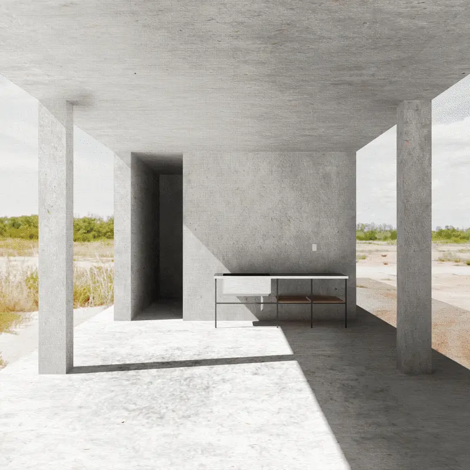
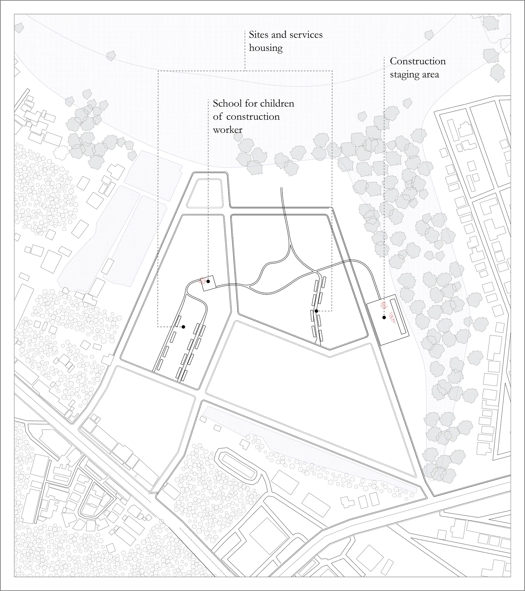
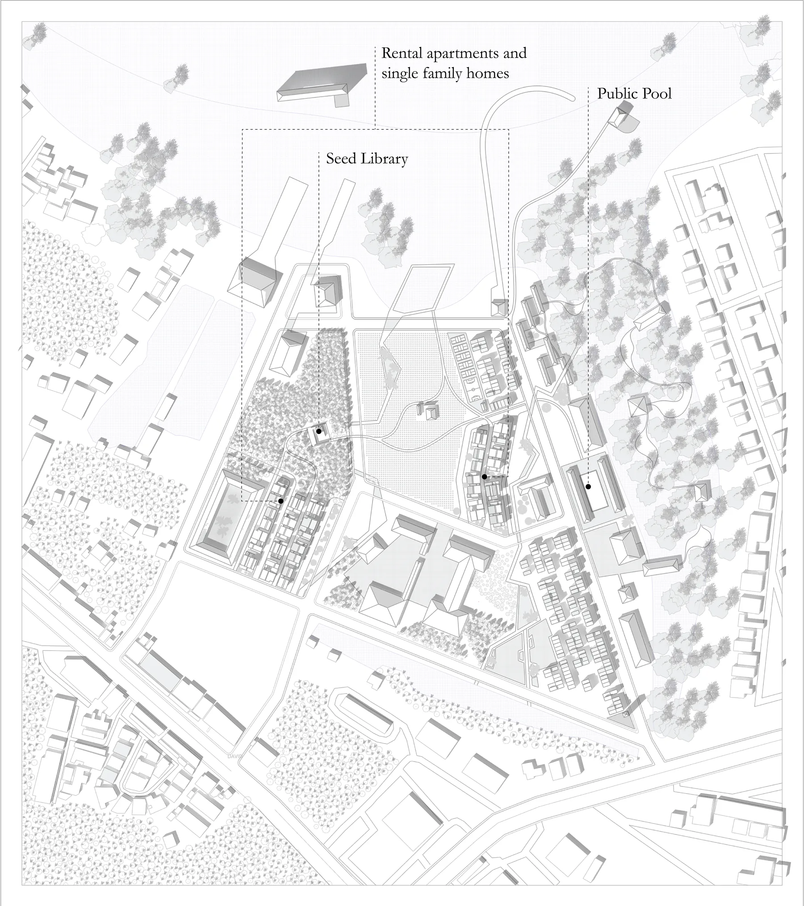
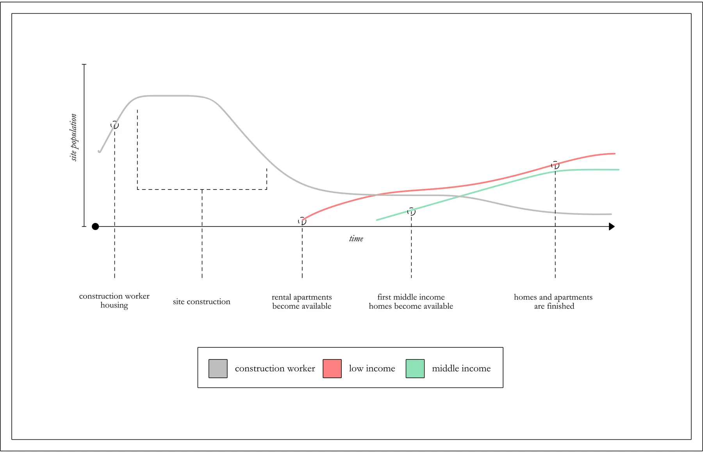
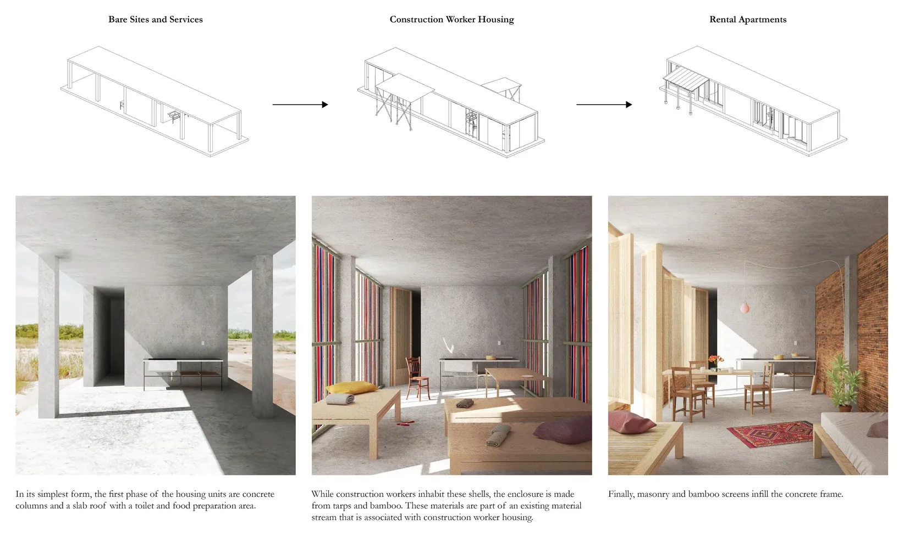
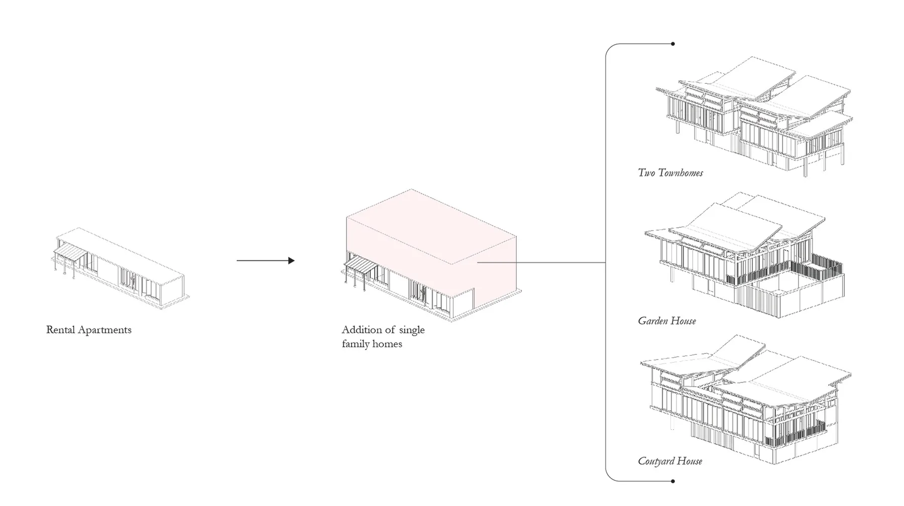
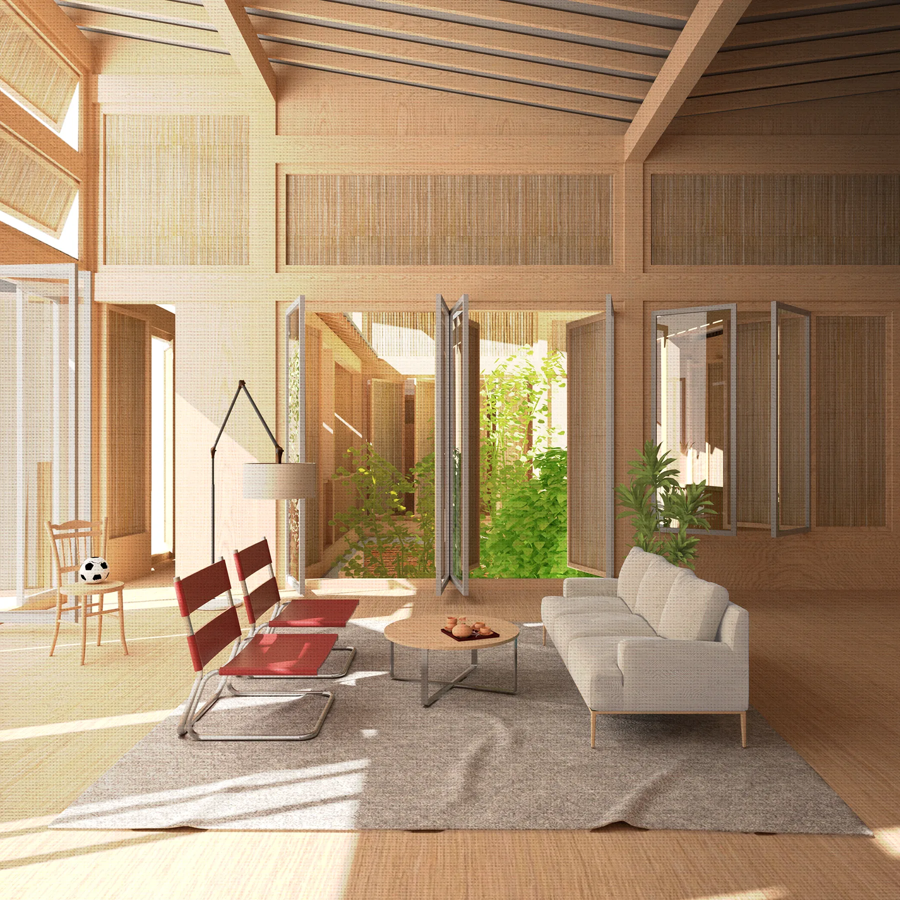
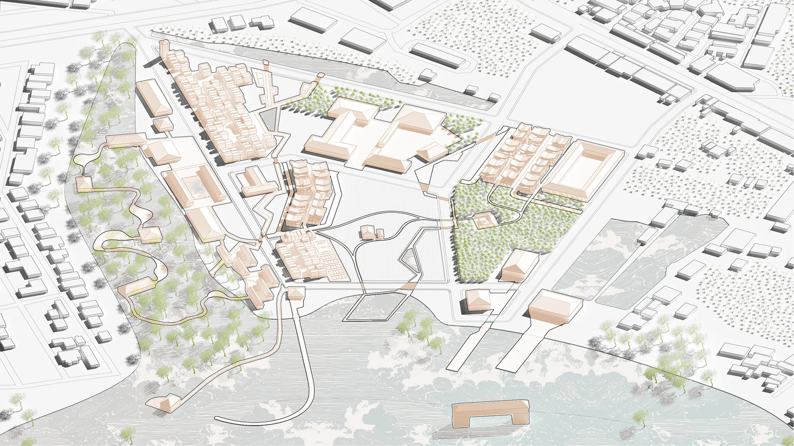

The EEC project promises exceptional investment in industry, services, and tourism over the next decade along the eastern coast of the Bight of Bangkok. The birth and life of the EEC will create a labor demand of over half a million, over 50% of which will be unskilled laborers. This labor population includes a high percentage of migrant workers that introduce complexities of seasonality and temporality. Unskilled laborers and low wage earner populations have long been subject to appalling housing conditions that are often informal, overcrowded, thermally extreme, and unhygienic. Accommodations is a multi-phased, mixed income housing strategy for the quickly developing region that attempts to meet housing needs over the entire timeline of a site. The strategy uses a model of incremental housing that provides housing for construction labor with a sites and services approach. After use by construction laborers and their families, the sites and services are incorporated into a mixed income housing development that integrates living spaces and accommodates various cycles of migration and space for the production of social capital within low income, and migrant, communities.

Given the expected growth in Chon Buri, how can our site provide housing solutions to both skilled and unskilled labor pools? Further, how can architecture provide for our site’s evolving housing needs, bridging the gap between the inherent differences in class, citizenship, and income of these two groups?

