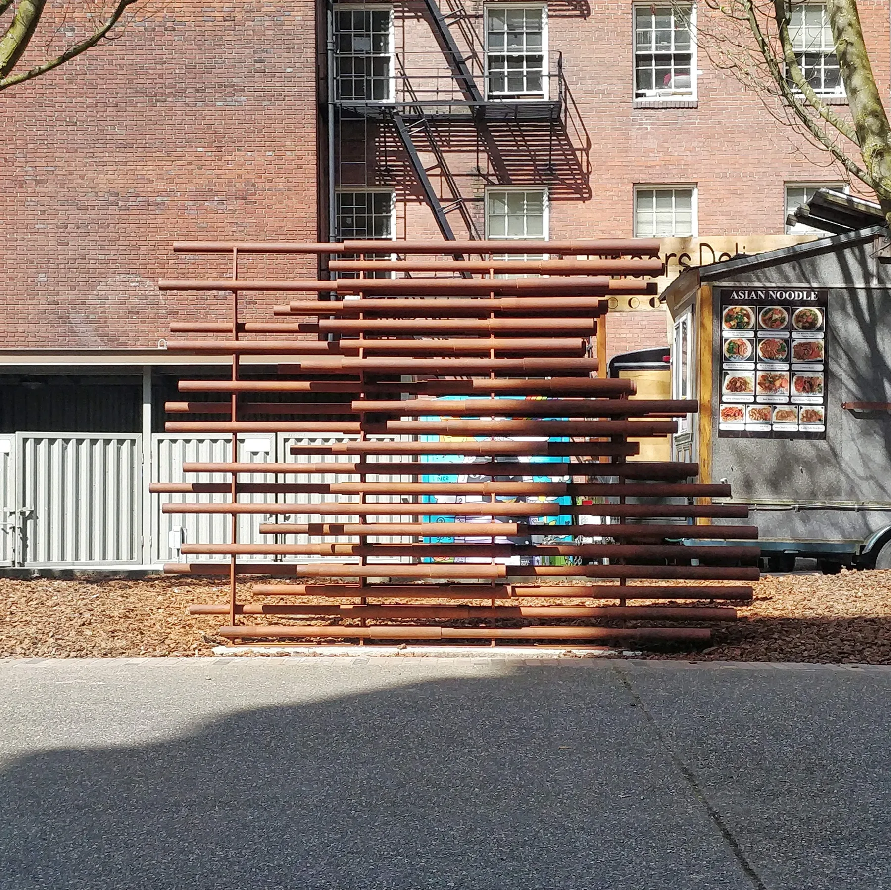

ArN2thrO2pO2cene is an installation that celebrates Oregon's 1971 Bike Bill and the positive impact biking has on the air we breathe. It was one of three Art of Loving Oregon projects the Oregon Environmental Council made for its 50th anniversary, and it honours Sam Oakland, the Portland State English professor whose ride of some 400 cyclists from Portland to Salem helped pass the bill. The anthropocene is a geologic time period defined by human effects on climate and the earth’s environment. One of the largest implications of human influence on our environment is the quality of our air.

Initial design inspirations were found in air flow diagrams and heat maps of bikers and bicycles. Produced using parametric design software, this installation abstracts the relationship between air, rider, and bicycle.

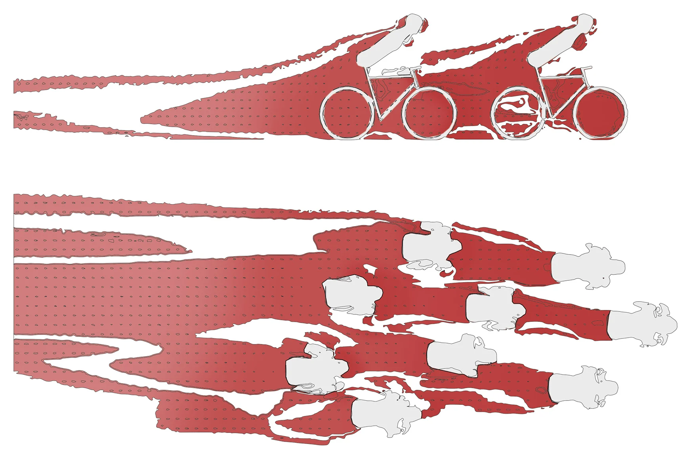

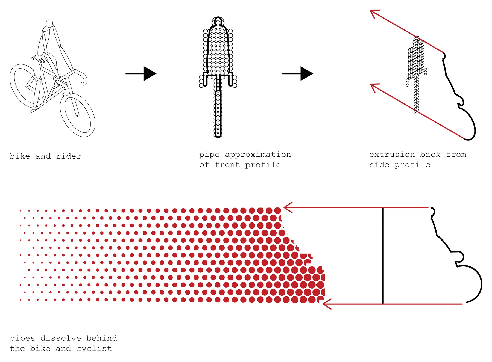

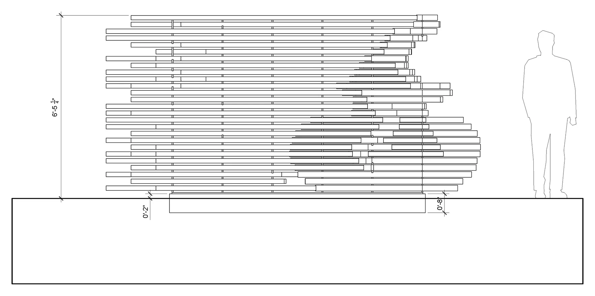

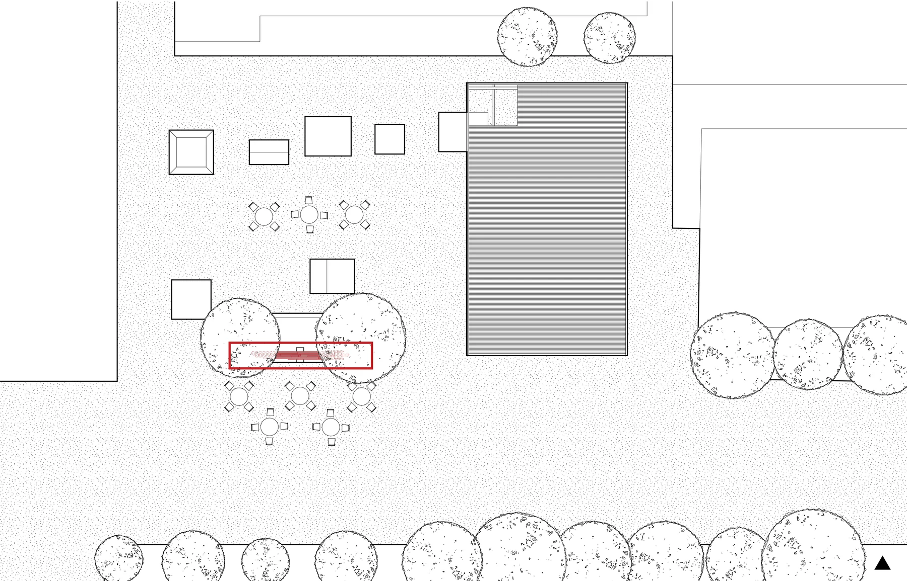

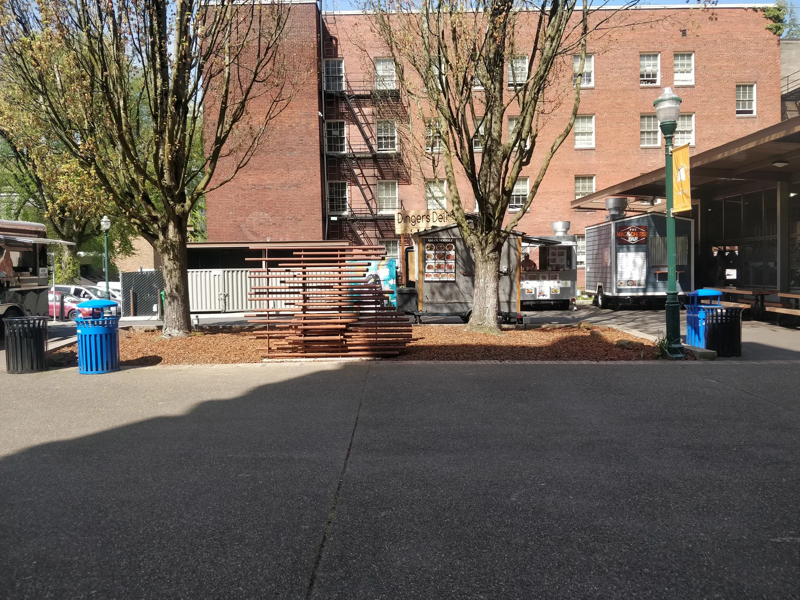

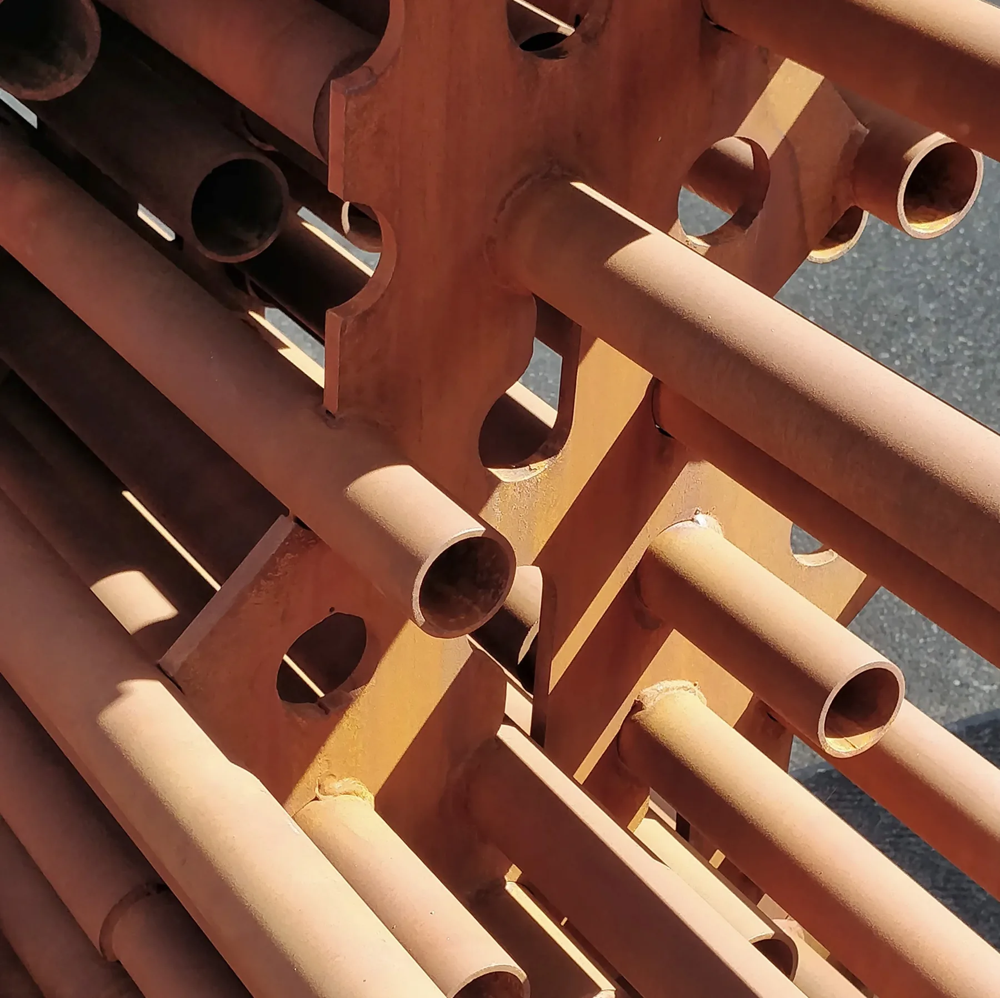

## Process

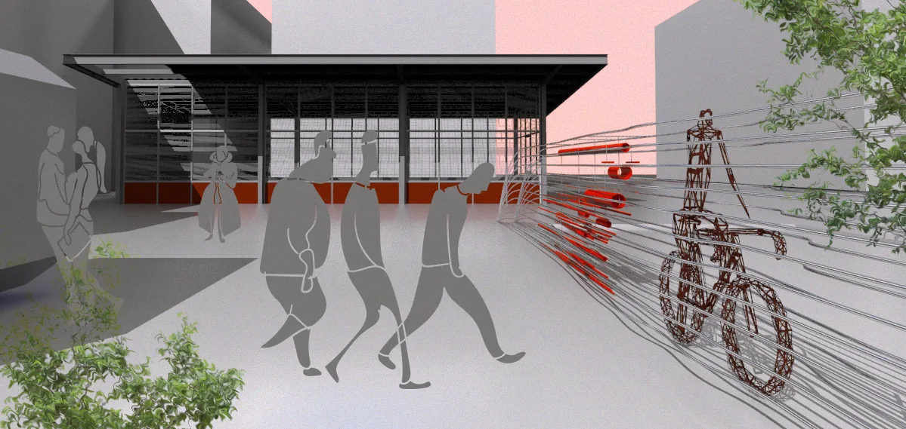

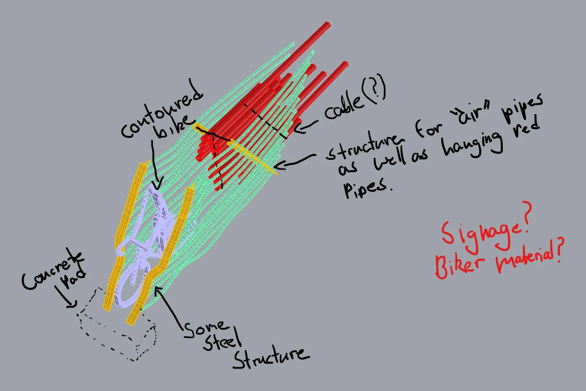

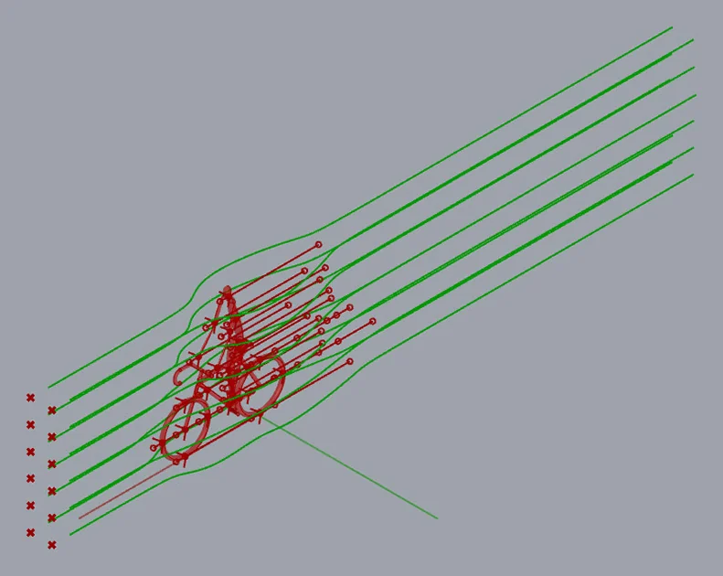

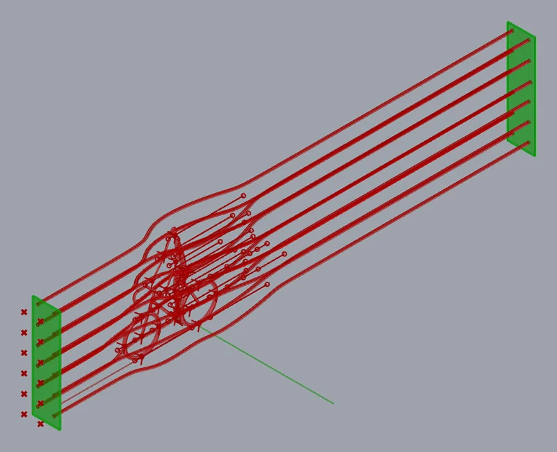

