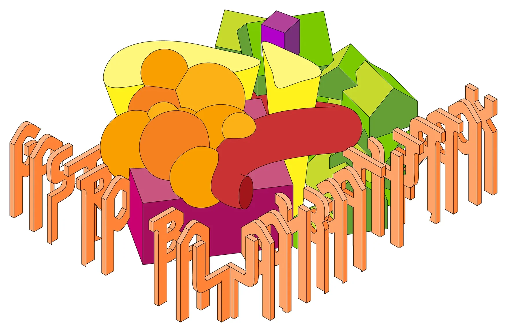
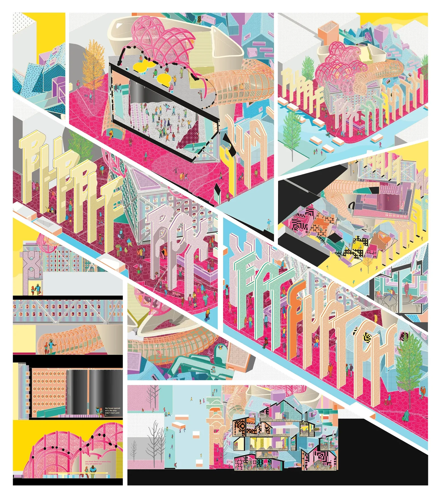
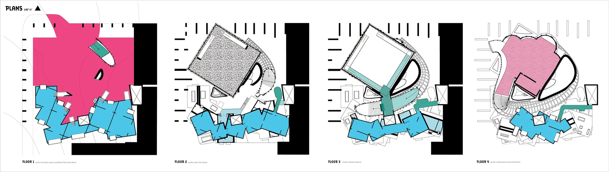
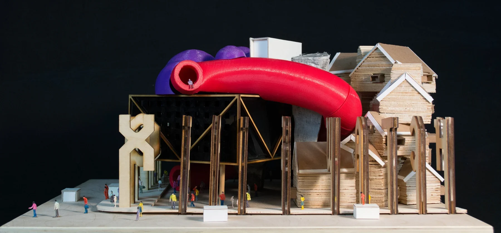
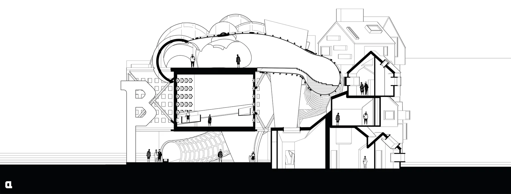

Professor Andrew Santa Lucia’s third-year design studio engaged with the practice of assembling volumes in digital three-dimensional models. Some referential, others arbitrary, these volumes were imagined. The forms were never intended to be architecture. Arranged in compositions, the volumes became three-dimensional diagrams. What started as a formal and volumetric exercise soon became a tectonic interrogation: could such an assemblage be transformed into architecture? Through the process of creating structures and addressing questions of inhabitation, the volumes took on an architectural and structural language. The theater, once a simple box, became a room created by a cubic truss. Other diagrammatic programs, like the stacked houses, office, and studio, became defined by simple slabs and an internal, load-bearing wall system. The diagram, now “tectonified,” was a combination of structure, material, and unconventional forms that begged to be represented accordingly. The axonometric drawing, both rational and constructed, provided an opportunity to honor such processes of transformation. The resulting drawing, loaded with color and texture, comparable to dazzle camouflage, acts as a circus of shapes and spaces that try to explicitly describe the architecture through dynamically occupied section drawings.

Published in the [*Journal of Architectural Education*](https://www.jaeonline.org/issue-article/bubble-box-eat-watch/) 72(1), 2018.

