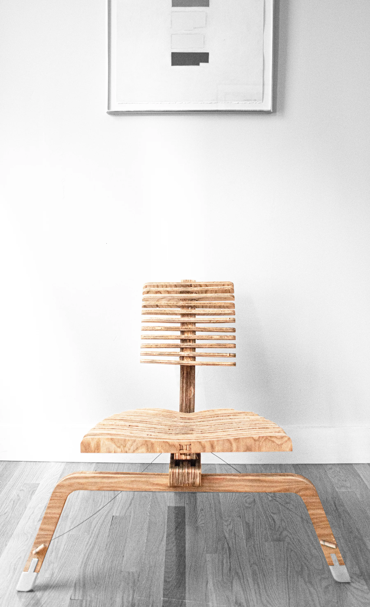
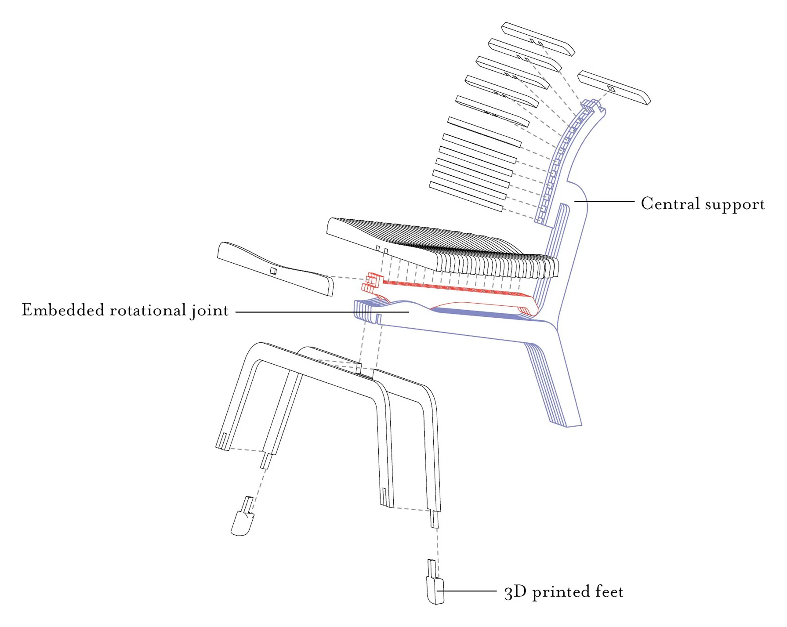
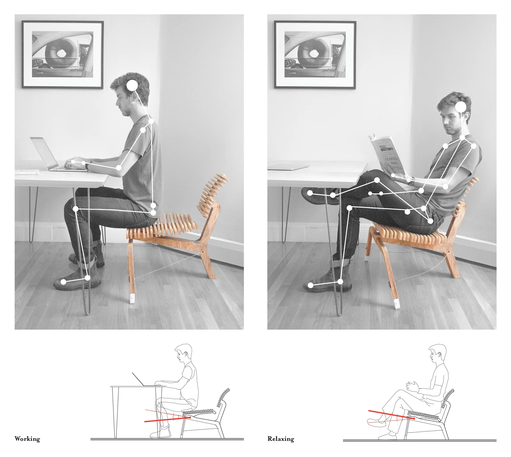

This chair was the result of a semester-long investigation of fundamental questions of digital design and fabrication, experience, and material efficiency. As designers, do we design outside of existing means of fabrication, leading to the choice of either innovating methods of making or shoehorning our designs into an existing workflow? Conversely, do we design according to specific techniques of production and innovate in the realm of experience and function?

In an attempt to innovate on the experience of a chair, this project asks the chair to serve two functions by offering two seating positions: one allows a relaxed seated position, and the other an upright position for work at a desk. These positions are allowed by a central trunk of the chair that houses a ball joint that connects to the seat. The chair is fabricated using simple CNC cuts from a single sheet of half-inch plywood, and was assembled in less than an hour and left to cure overnight.

