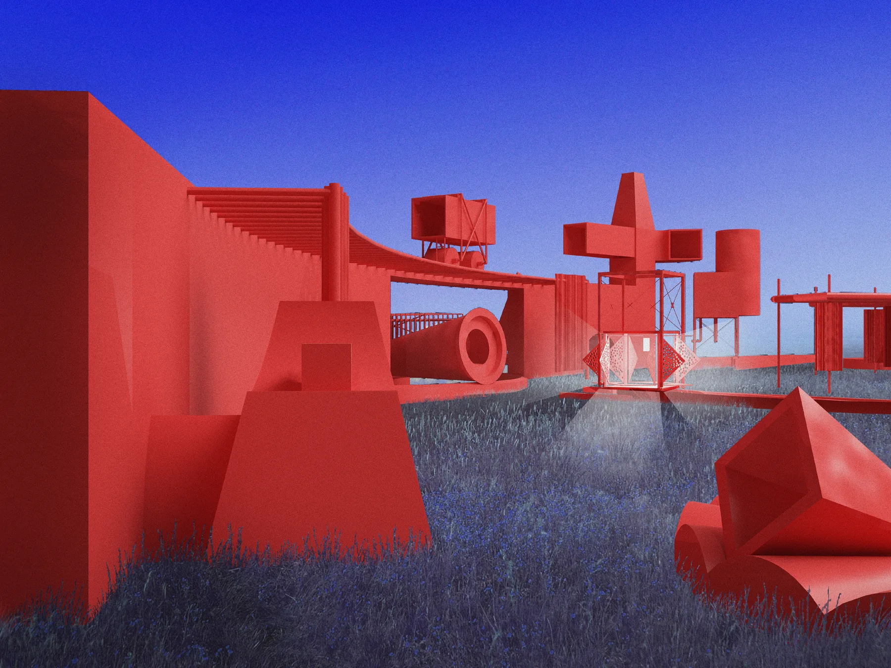
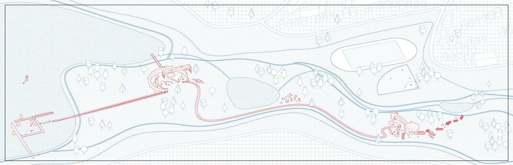
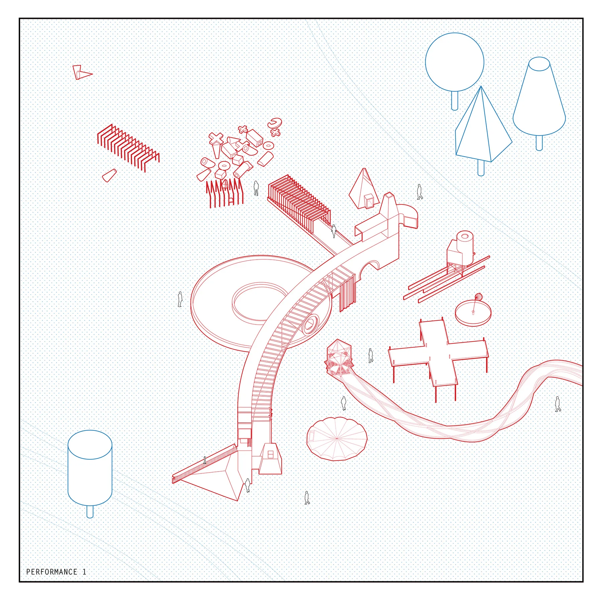
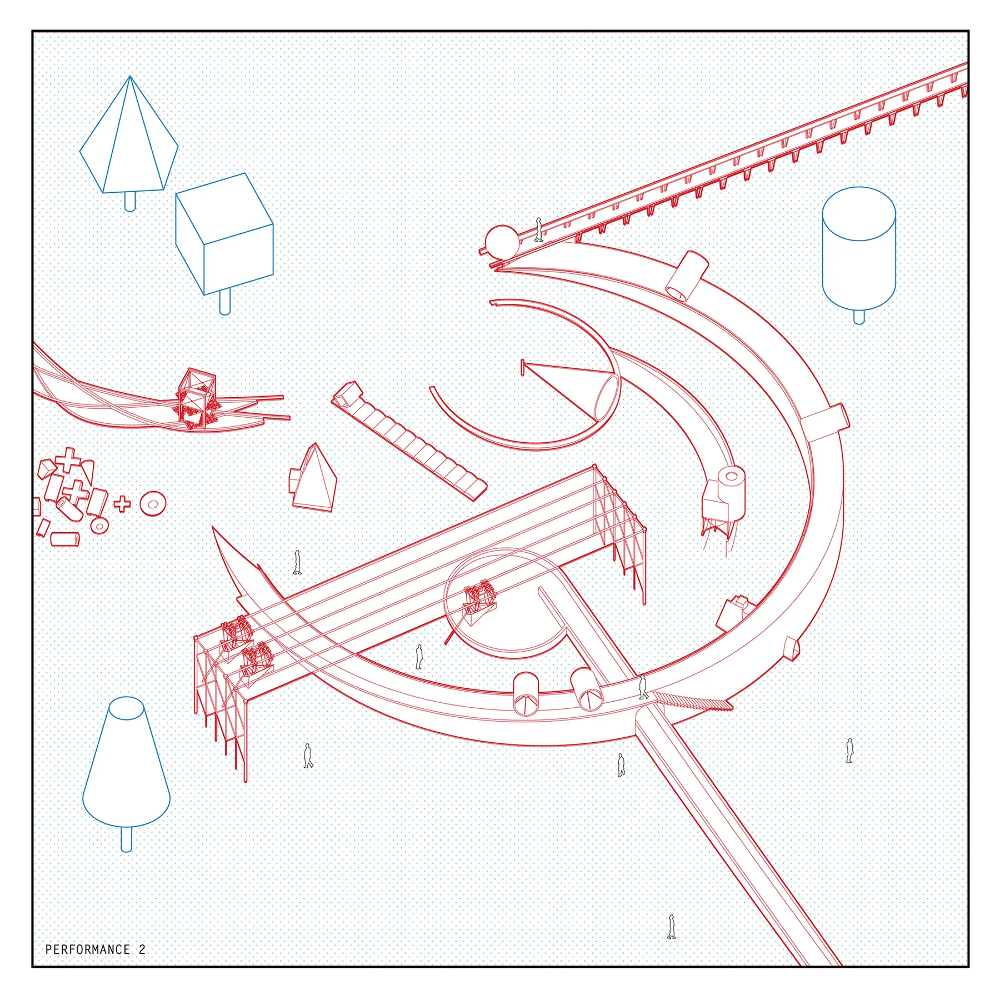
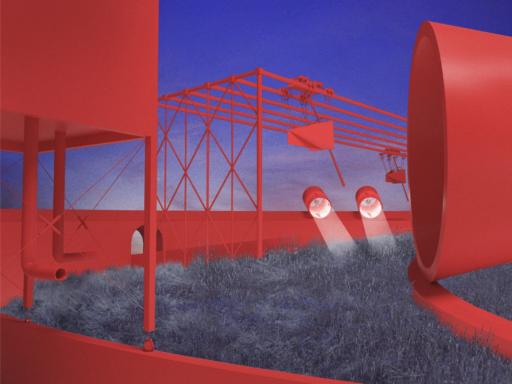
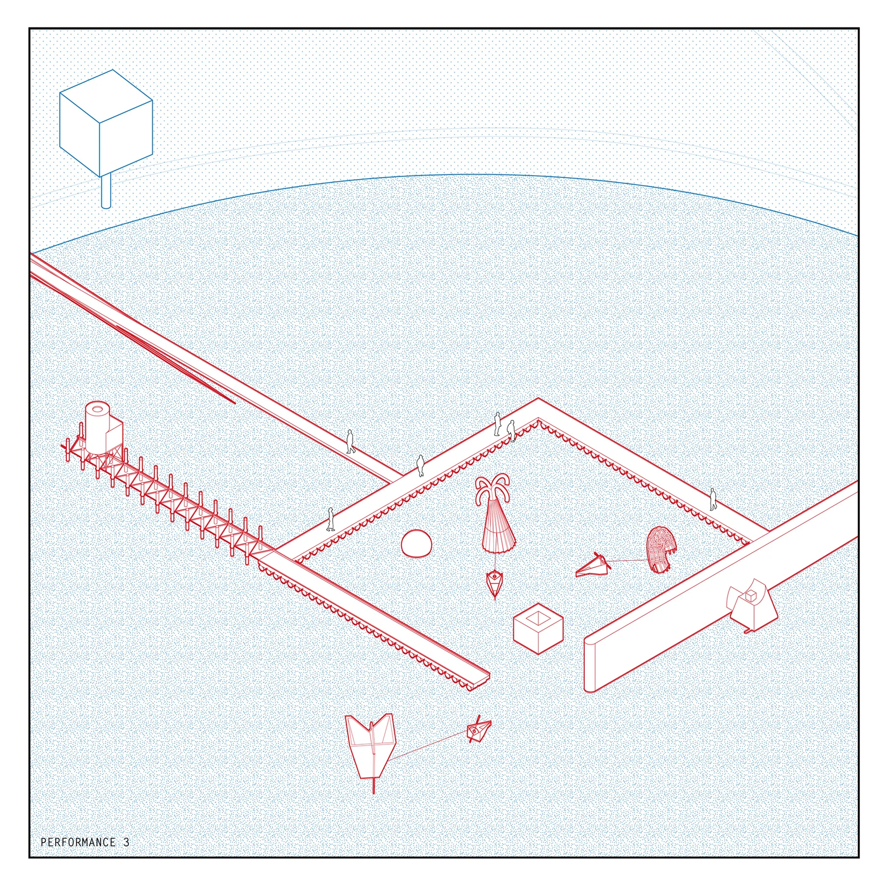
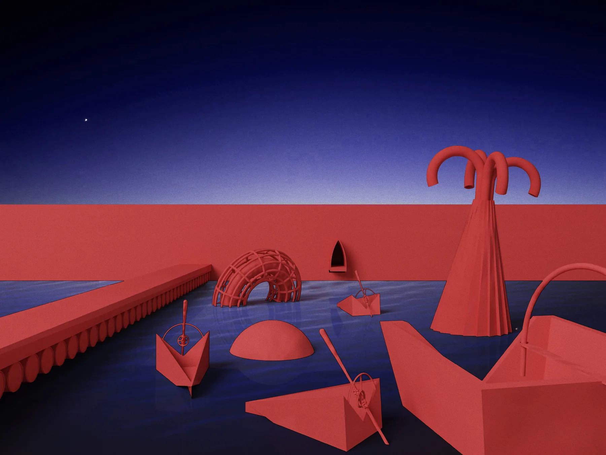

This is a particulate theater of architectural figures. Its deconstructive logic is found in functions and components commonly found, or considered to be, the basis of a theatrical space. Lights, sound, curtains, props, etc., all recognized as components of a theatrical experience, are no longer a diffuse, integrated system, but are objects with character. With a scatter of platonics as the basis of form and planimetric composition, these components of theater and phenomenal elements of light and sound question the relationship between theater and actor/character.

- The figure’s scale is not of a building, nor is it a tool. Their scale lies outside of the everyday encounter.
- Figures are discrete and are activated by architectural conditions that enable motion.
- The distribution of figures creates a theatrical field.
- The person or the body’s role in this performance is integral but is in complete service to the performance.
- The relationship between body and the theatrical component is not reciprocal.
- The bodies that facilitate the performance surrender their subjectivity to the actors, the characterful objects.
- The people who assist the performance are specific and unique to each performance.
- There is a distinction between the audience and the cohort of assistants.
- The participation of the audience is not explicit or necessarily required.

The stage is traditionally an open matrix that accommodates any number of compositions. A stage’s expanse accommodates both density and movement. With the ground as the stage, density is found in the result of the scatter. Movement is found both in the intrinsic motion of a given platonic aided by tracks and artificial ground condition that give agency to an otherwise static object. The ground, or the stage, is no longer an open matrix, it prescribes direction and gesture.

On the evening of June 30th, these three 15-minute performances occur in sequence, from north to south.

## Performance 1

The audience enters from the north through framed trellises and gathers in the lobby, which sits on 50 wheels on a track. When it is full, the lobby rolls toward a sunken, circular threshold through the wall, and the audience walks under it into the arena. A cone the size of a person pivots around a circle, dropping a canvas as it goes. A larger cone circles two walls, sound coming from its opening, while a cart on top of the wall draws back a curtain. A small pyramid rolls over a scalloped plinth, shedding dust. Then doors on a suspended box crank open, a bright light flips on, and the box rolls away along its tracks into the woods.

## Performance 2

The box of light emerges from the woods at the top of the hill and lights a court inside a circular wall. A hollow box rolls down a scalloped track, and sound reverberates as a cone rolls back and forth. Boats on a gantry crane are winched up over the wall and lowered into the pond below, while lights in cylinders roll along the top of the wall. A figure punts the boats away toward the lake, and a sphere at the top of the hill begins to roll down its tracks toward the pond.

## Performance 3

The sphere crashes into the water, and water washes against the floating platforms. Boats pull figures into an enclosure on the pond and release them. A pyramid pumps water into itself and sinks toward the surface, a ridged cone with thick rounded horns bobs and lights up one horn at a time, and a caged torus rattles. The boats’ operators step out and pass through the wall into a room lit dimly by a hint of light from the sky.

This project is one of composition, the architectural figure, and time.

I was initially interested in scatters and distribution sculpture like those of Barry Le Va, partnering with chance, to create compositions and geometric relationships. Hejduk’s Victims became an influential precedent, specifically his dynamic plan of Victims. Notions of compositional randomness found in some of Noguchi’s early work like the US Pavilion at Expo ’70 or the Cullen Sculpture Garden use the ground in a specific compositional way and as a datum that describes relationships between objects. Both Hejduk and Noguchi guided the project to the question of the figural architecture, as did early projects from RUR and Alice Aycock.
