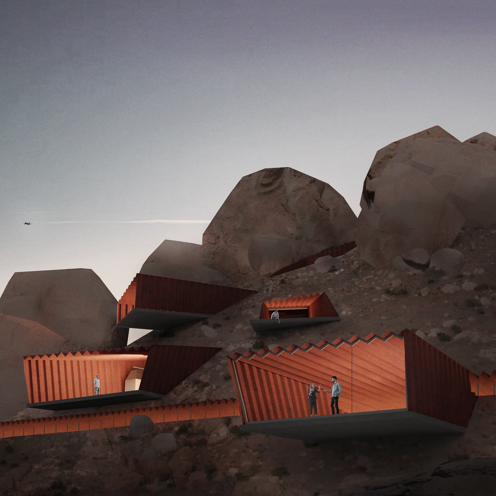
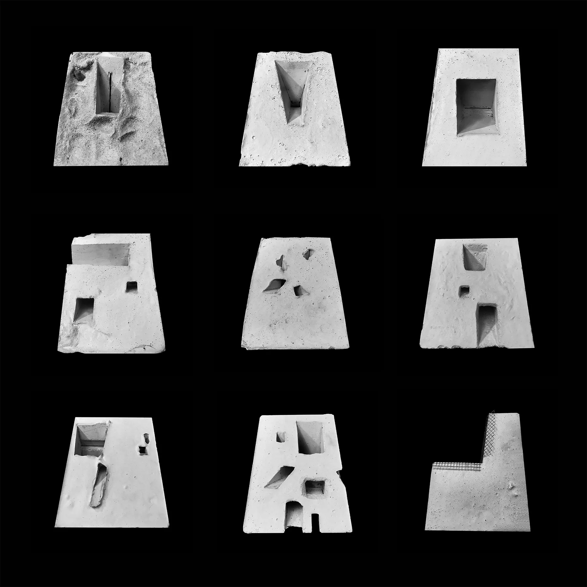
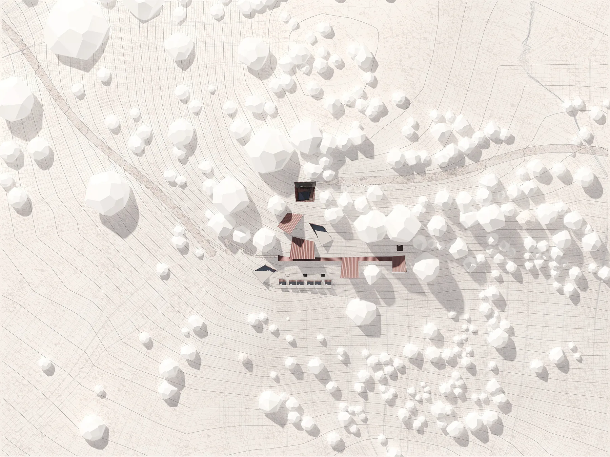
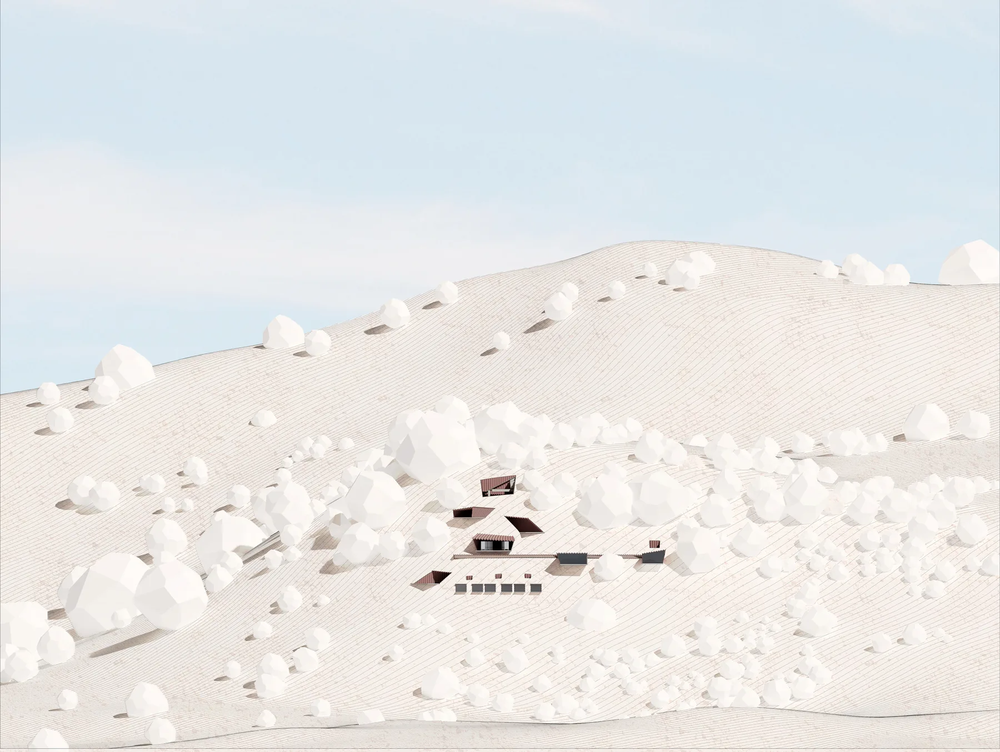
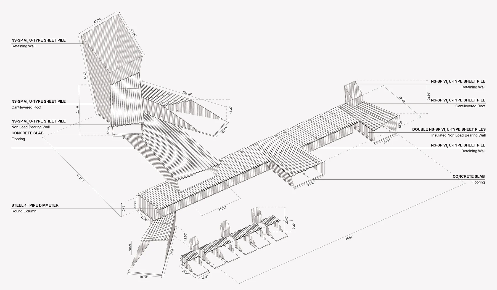
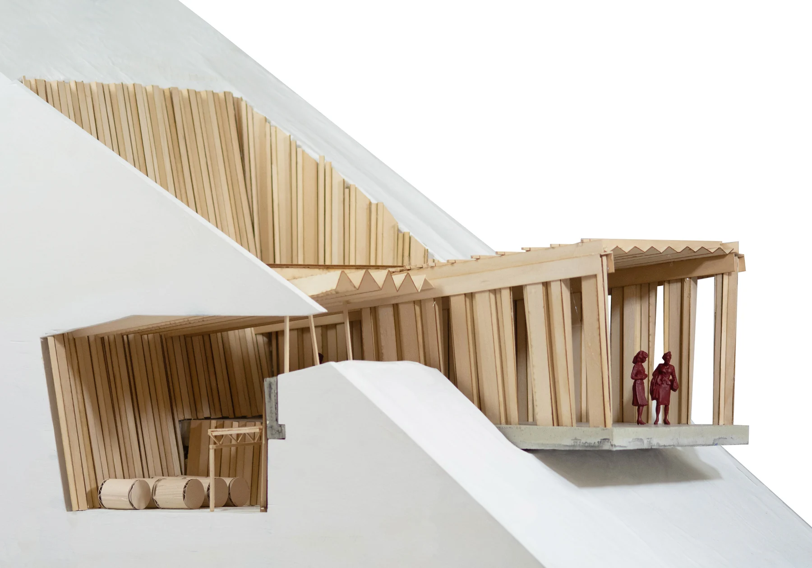
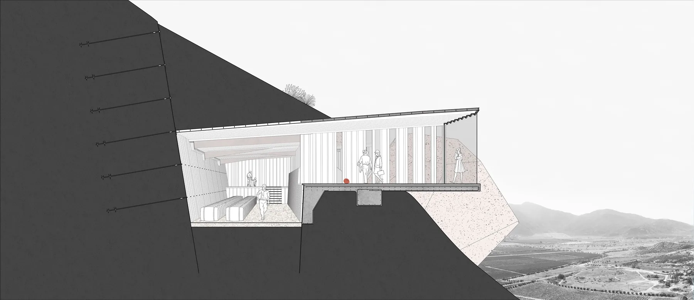
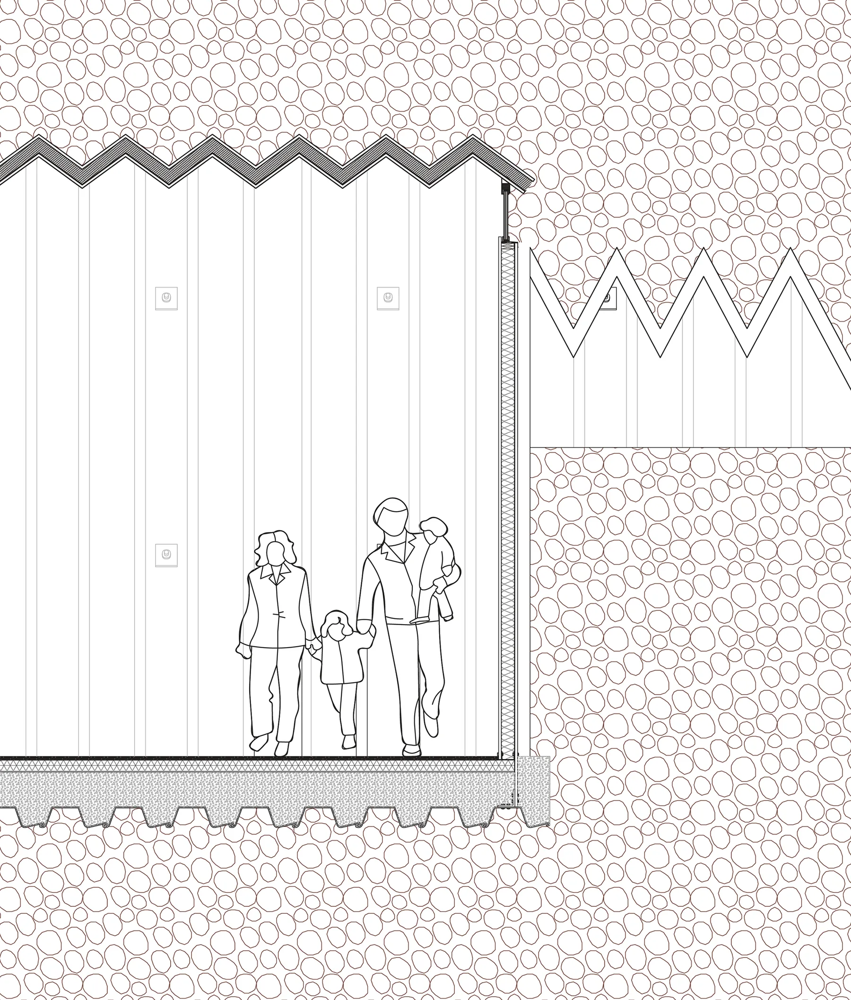
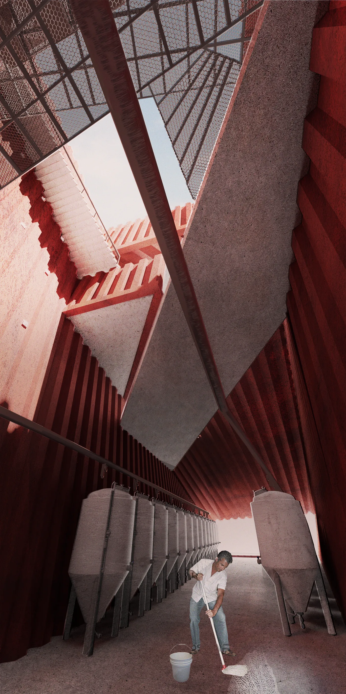
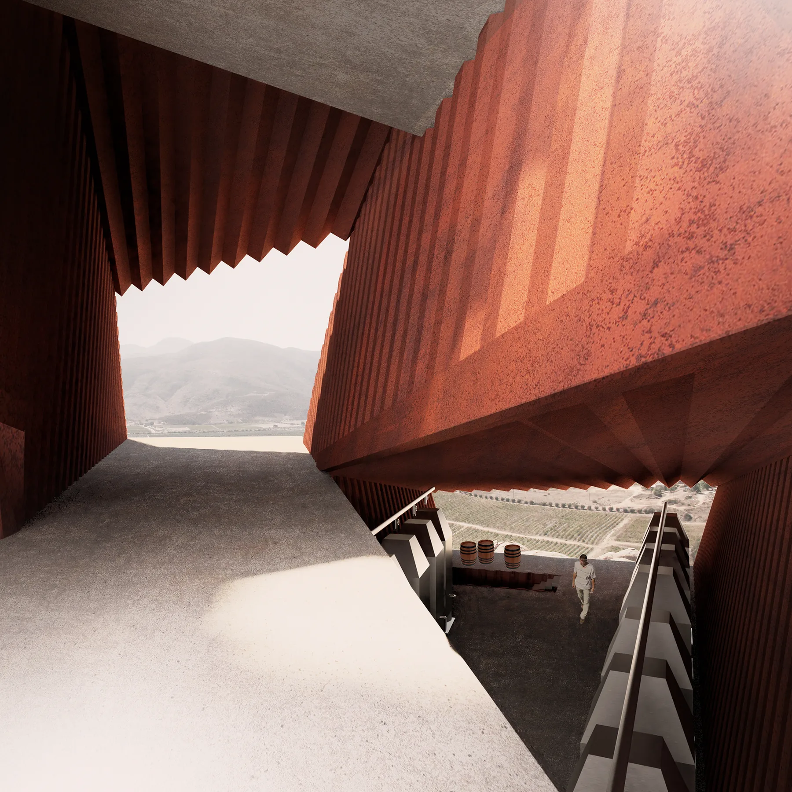

Deep Cut is a winery that leverages excavation as its main spatial driver.

The winery is embedded in the terrain, using excavation as a means of altering the landscape for inhabitation and production. Using a method of excavation found in large-scale infrastructural projects, the project exhibits steel sheet pile construction and demonstrates it as a solution for building on sites with steep slopes. The process of construction excavates and replaces earth, leaving an occupiable void for both public and private programs.

In the context of the Valle de Guadalupe, the slope is exposed to high levels of solar radiation for extended periods. While the climate is comfortable for most of the year, winemaking requires a more controlled environment. Excavation offers two distinct advantages: a gravity-fed winemaking process, and the thermal coupling of earth and building to create optimal conditions inside.

