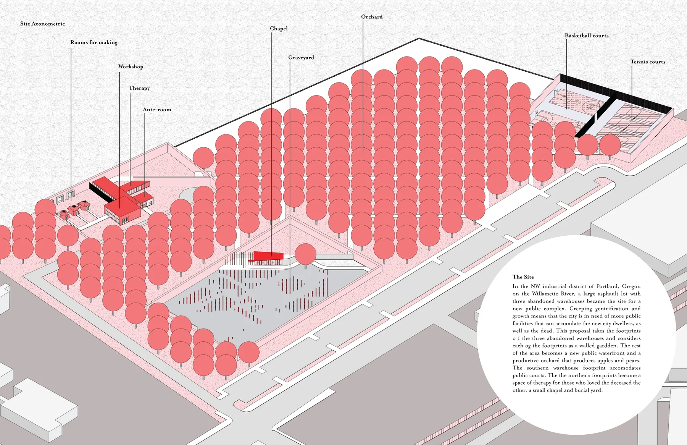
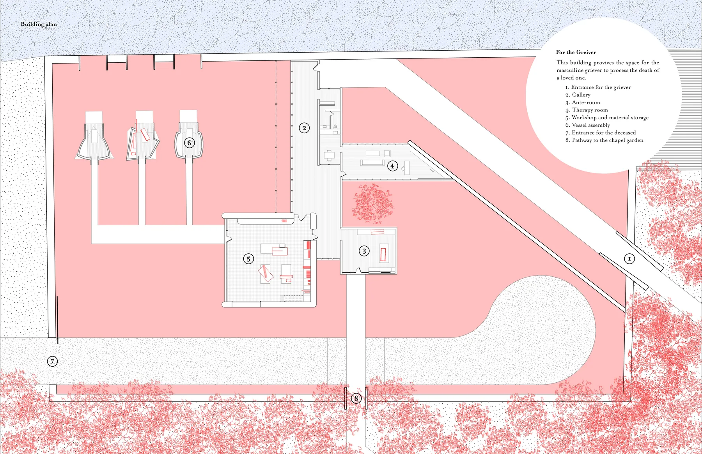
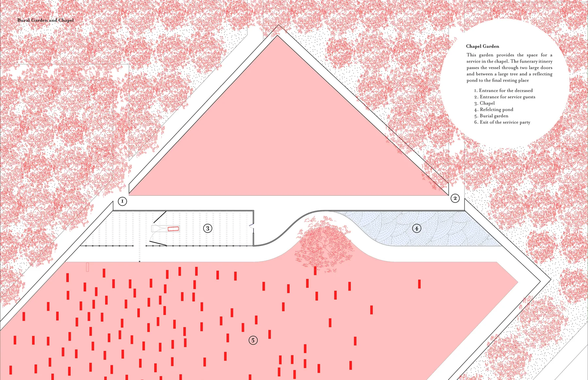

Expressions of grief come in many forms for many different people. For those who have assumed a masculine identity, the act of grieving can be especially complex. Today, representations of grief in culture are expressed through emotional releases, sadness, crying, and quietness, all of which are largely considered to be feminine qualities or components of a culturally understood femininity. This creates a social understanding and assumption of “correct” grieving processes which result in methods of grief support that marginalize masculine grievers. Masculine grief is characterized by a reluctance to engage in emotional tasks of grief, the resistance of emotional support, and a general mitigation of emotional expression. The tendency to internalize emotion in masculine grief makes it difficult to identify the griever, thus they go unnoticed. Masculine grievers are action oriented and use doing as a means of controlling emotion. They seek companionship not for direct emotional support, but companionship in their actions. Masculine grieving tends to happen when that person is alone in a private place.

