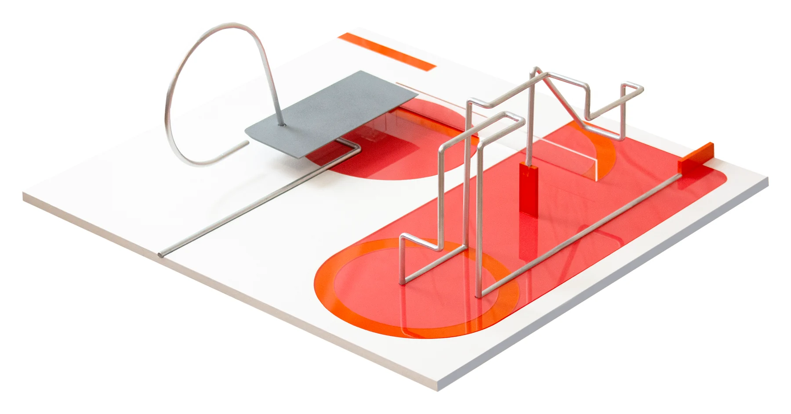
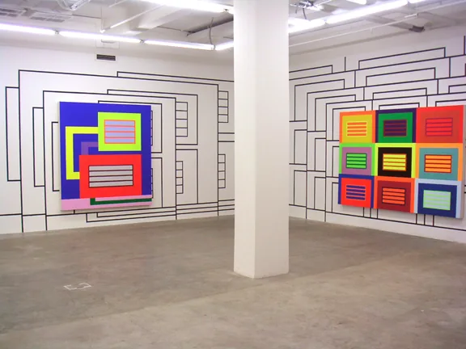
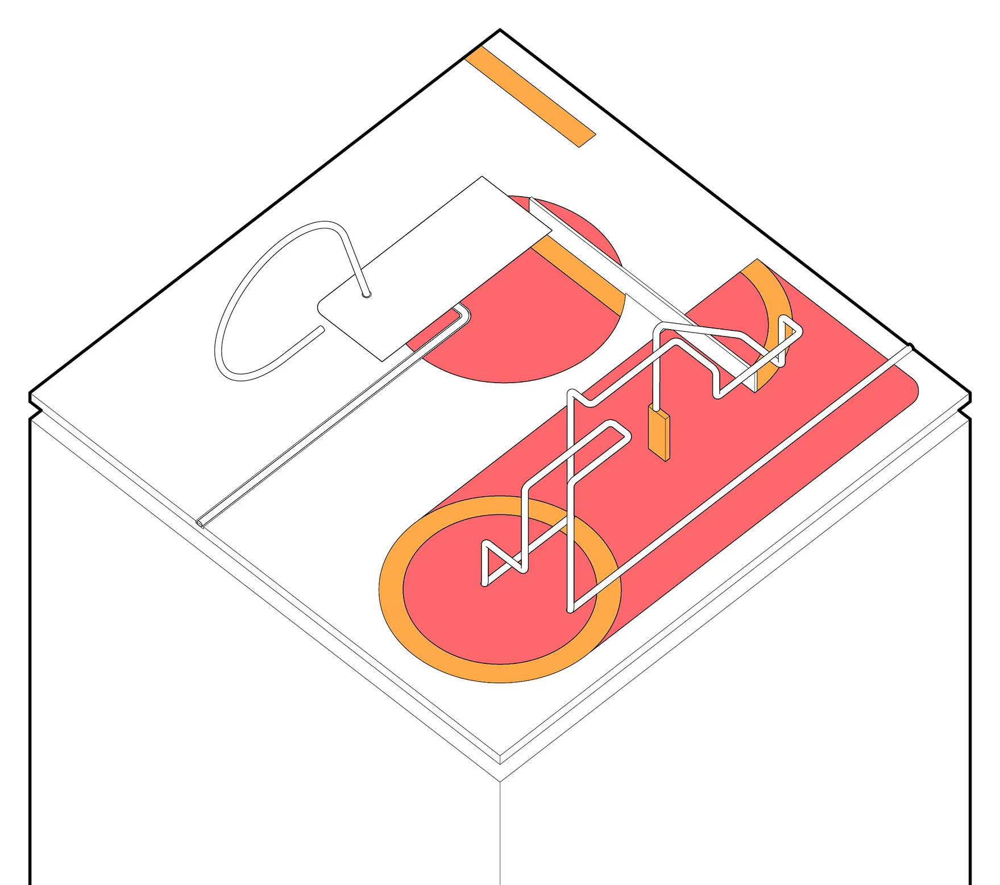
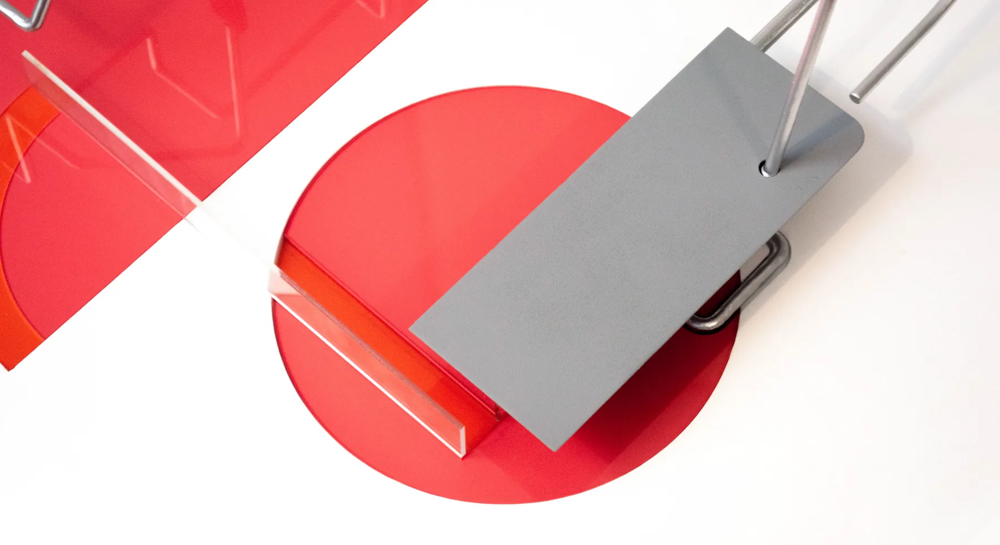
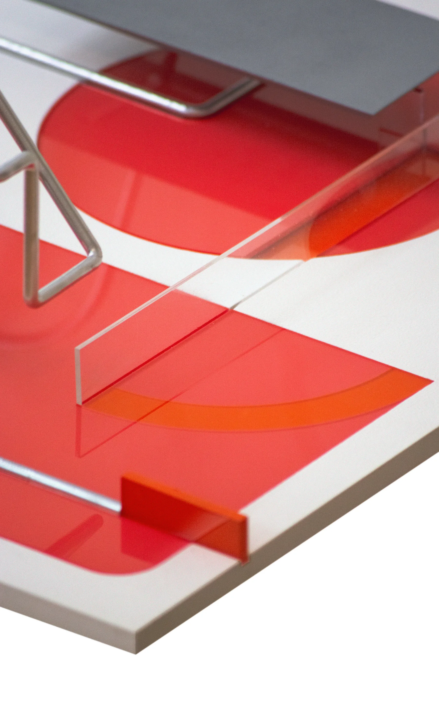
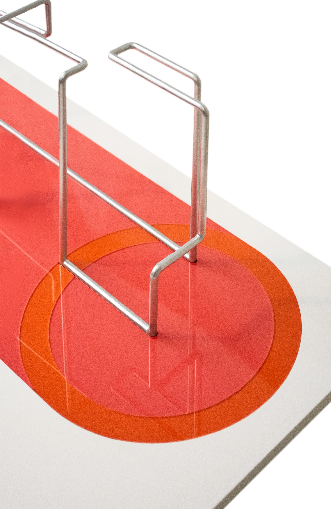
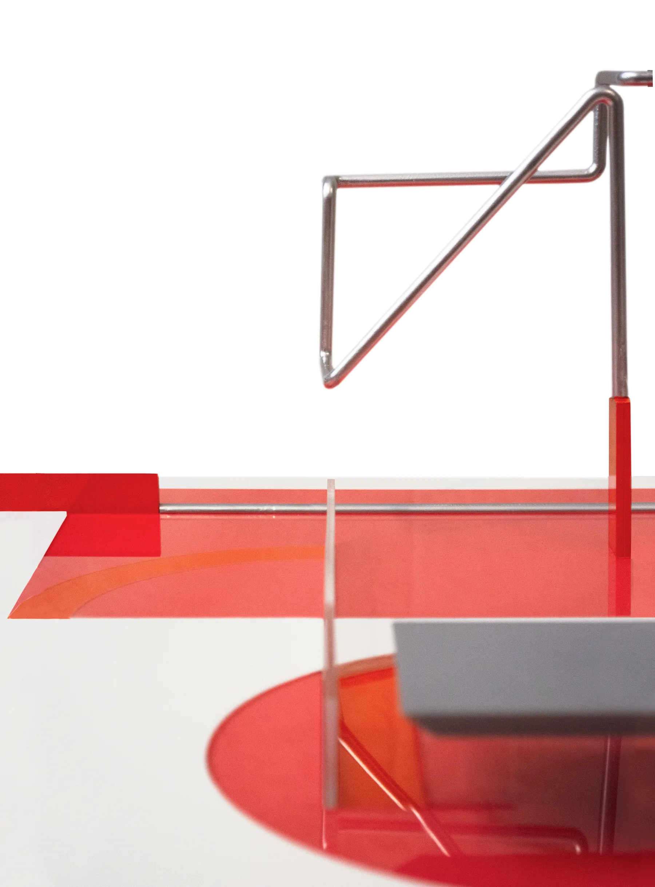

This model for the student exhibition *Part Objects: Precarious Structures and Other Forms of Sculptural Disorder* is a response to the unintended collaboration between Peter Halley and Alessandro Mendini. In Halley’s talk at the Garage Museum in Moscow in 2017, he recounts being commissioned for a permanent exhibition at a hotel in Italy designed by Mendini. Halley did not install the painting himself, and the curator held off on sending him photos of the installation because Mendini had decided, without his knowing, to design the wall paintings upon which Halley’s paintings were hung. “My friend [the curator] thought I would be very angry about it -- but I actually loved it!” The result was a collaboration between the two at Galleria Massimo Minini, pictured below.

The exhibition pieces combine Halley’s minimal, rich, saturated color fields with Mendini’s thin, black, circulatory lines that engage the figure-ground and reference socio-cultural connections in Halley’s work. The exhibition model expands on this collaboration by folding in three-dimensional, structural, precarious aspects, creating a dialogue between the ground plane, used as a graphic datum, and thin wires that rise from the plane and extend beyond the bounds of the model.

