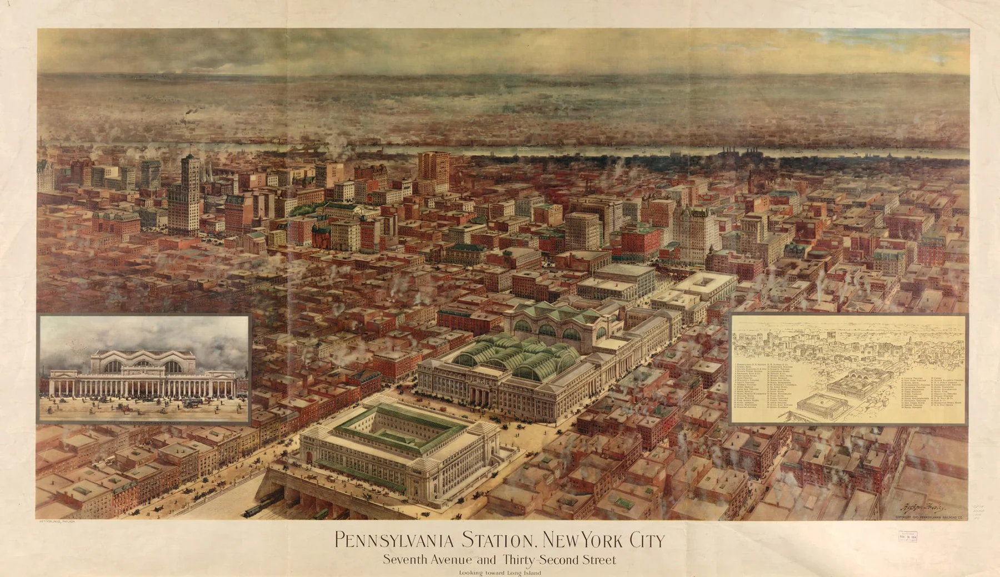

At the turn of the 20th century, two large public buildings were built above the train lines in New York: Penn Station and the James A. Farley Post Office.

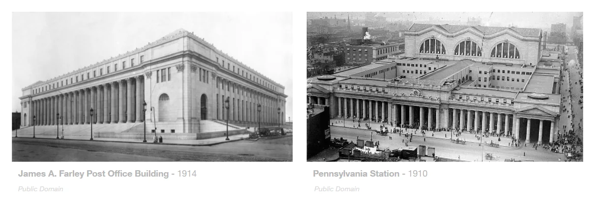

These two Beaux-Arts buildings sit next to each other on Eighth Avenue in Midtown West. Both were designed by McKim, Mead & White.

What started as an open-air station was capped by Penn Station and the Farley building. In 1963 Penn Station was demolished by the Pennsylvania Railroad Company to make way for Madison Square Garden.

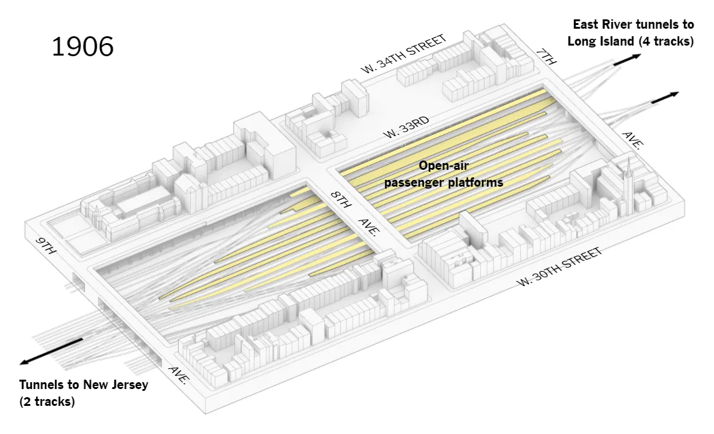

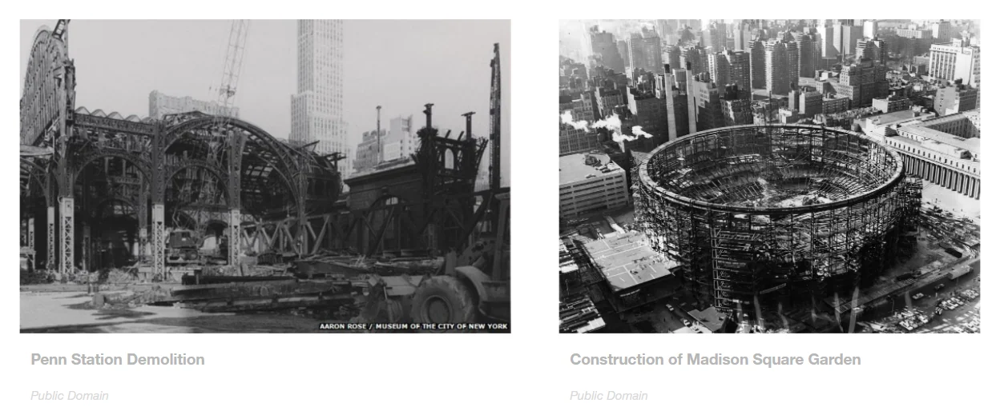

The demolition was a very controversial decision, and it became a turning point for how the US thought about architectural preservation.

## Enter Senator Daniel Moynihan

Moynihan held a position at the Harvard–MIT Joint Center for Urban Studies, and in the early 1990s he spearheaded a plan to adapt the Farley Post Office building into an extension of Penn Station, because he was nostalgic for the old Penn Station and his time commuting through it.

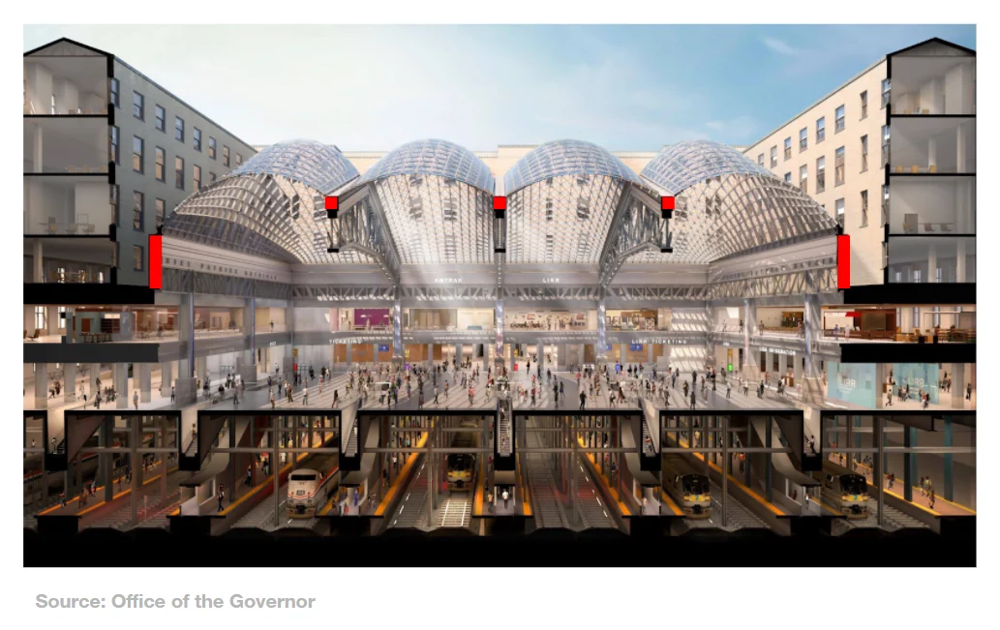

SOM won the project with a design in which the old mail sorting room is now a new passenger sorting room, under four large cable-braced steel grid shells that use the existing steel trusses.

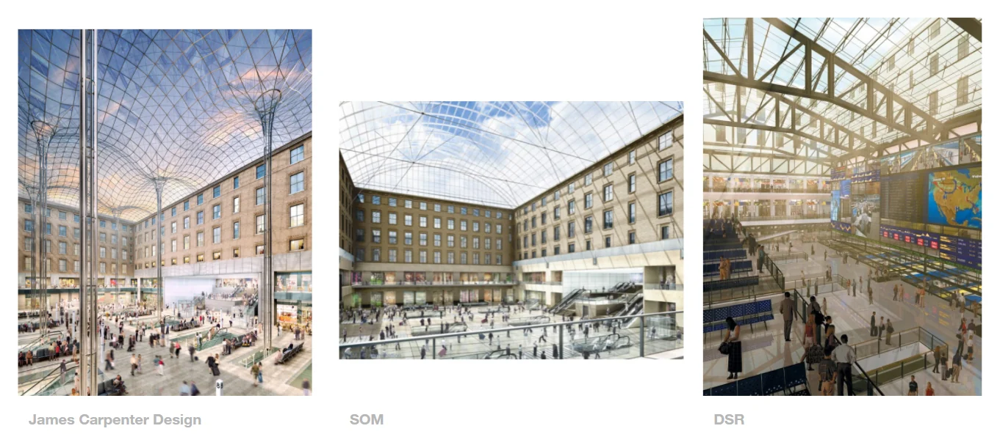

Losing proposals from a range of firms used a similar strategy, some keeping the existing trusses and some replacing them. This led to the question: what are the structural, spatial and embodied carbon consequences of keeping the historic trusses?

For the study, a workflow of form-finding (in Kangaroo), structural analysis (in Karamba 3D) and embodied carbon analysis (in Cardinal LCA) was used. The existing shells were approximated from a photogrammetry mesh of the building: form-finding with loads scaled inversely to their distance from the centroid, Z = α / (distance from centroid), gave a shell that matched the roof in section.

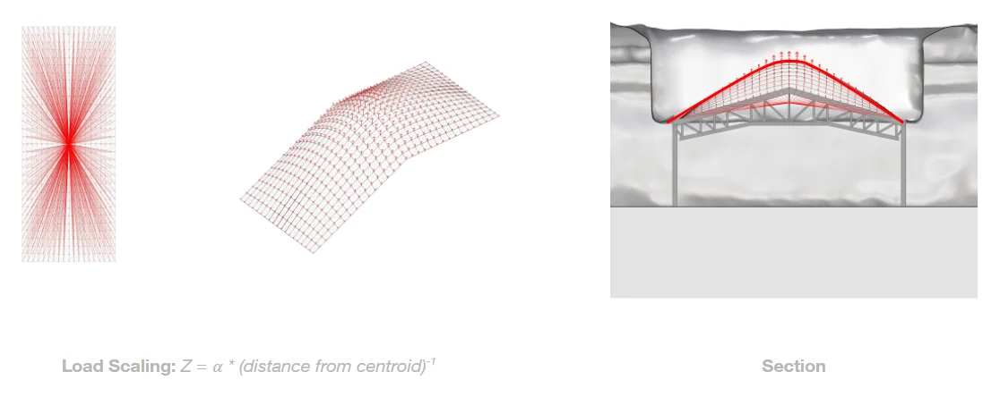

Two cases were devised to compare against the existing design, the Base Case (Case 1). Case 2 adjusts the form of the grid shell and still uses the trusses. Case 3 follows one of the losing proposals, which did not reuse the existing trusses.

In each case the cross section of the members (8 to 10 cm wide and more than 20 cm deep) and the form could vary, while the surface area was held constant. The structure was judged by its efficiency, Σ|F|L, the axial force in each member times its length, summed, with the maximum axial compressive force as an upper limit. Embodied carbon was counted in tonnes of CO2 equivalent, from the Inventory of Carbon and Energy (ICE) 2019 database.

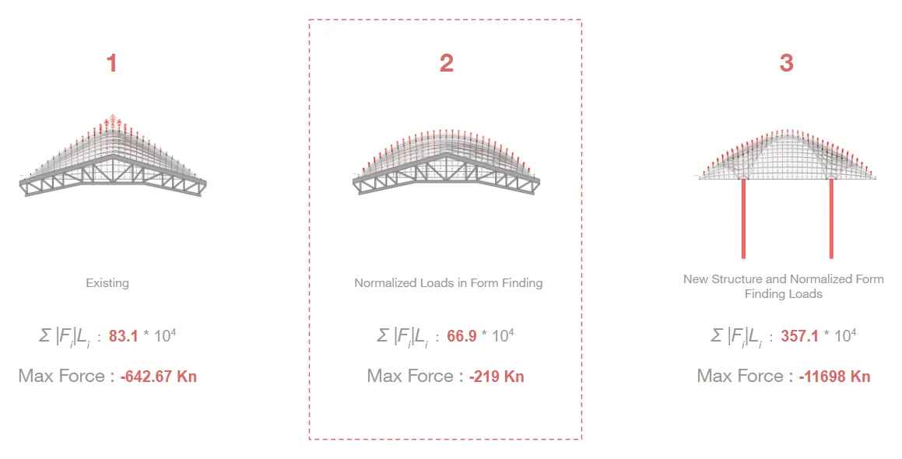

Interestingly, Case 2, which uses normalized loads across the grid shell nodes for form-finding, performed more efficiently, with a much lower maximum compressive force.

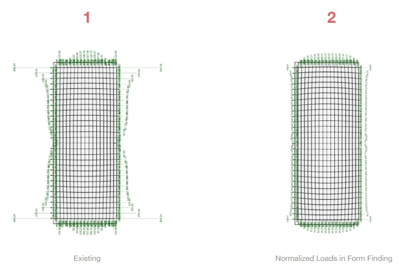

A possible explanation for this is the reduced reaction forces out of plane with the truss at its peak, as can be seen in Case 1.

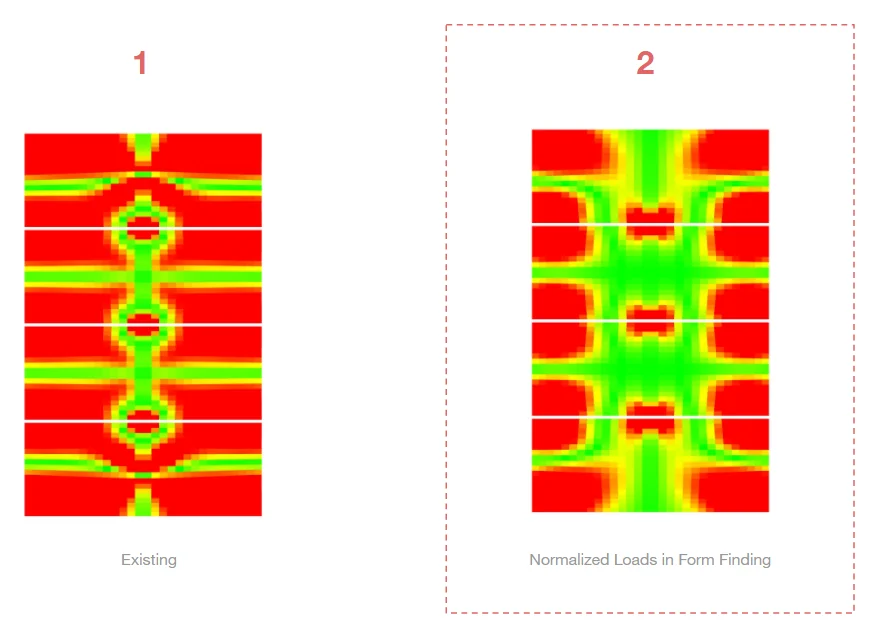

The shell form-found with normalized node forces also produced much higher planarity across the shell (seen in green).

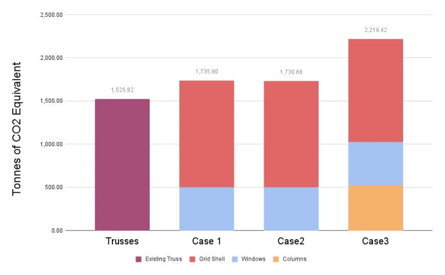

Altogether, Cases 1 and 2 embody a similar amount of carbon equivalent. Case 3, which required additional structure, having removed the existing trusses, unsurprisingly embodies more CO2e.

I feel that it is only fair to include the embodied carbon of the discarded trusses in the calculation for Case 3, which means it embodies about 2 kilotons of CO2e more than Case 2. At the 400 g of CO2 an average car emits per mile, that is 5,000,000 miles of driving, or 200 road trips around the earth.
