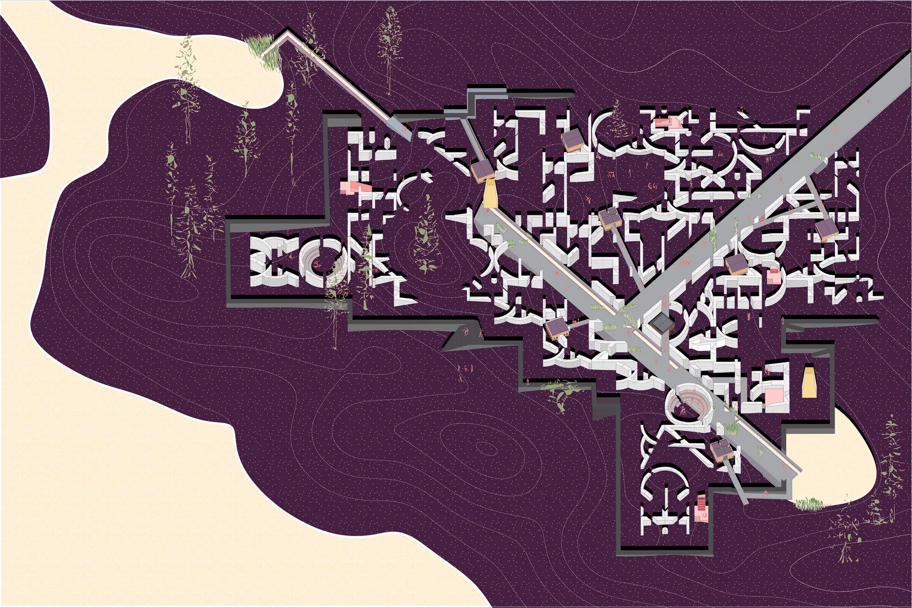
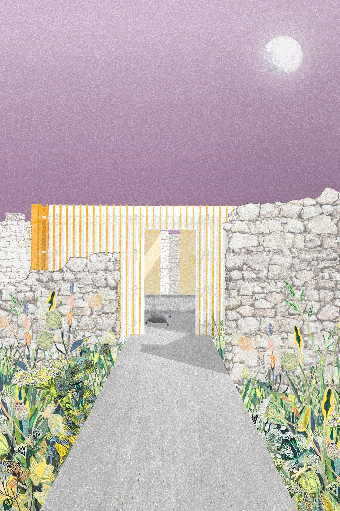
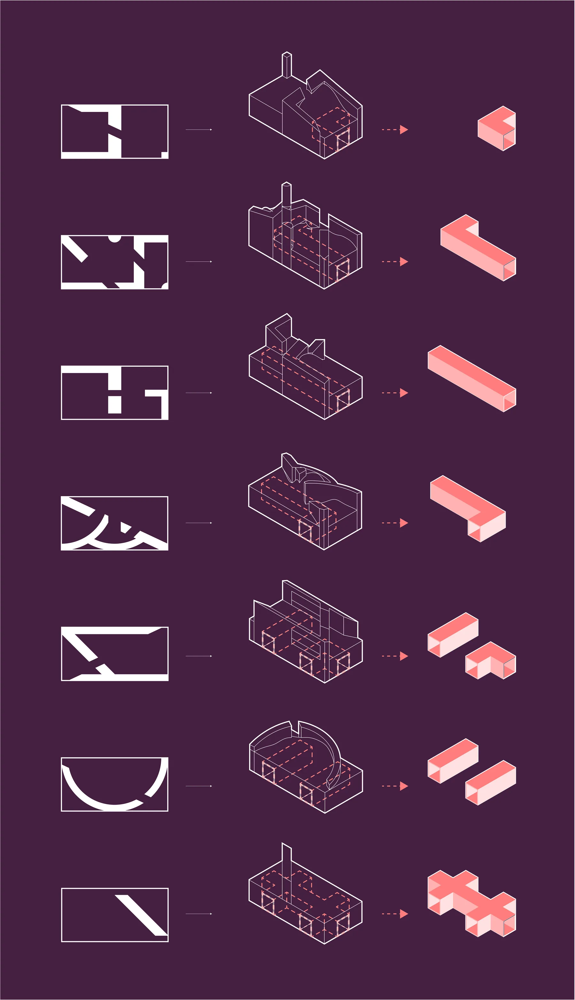
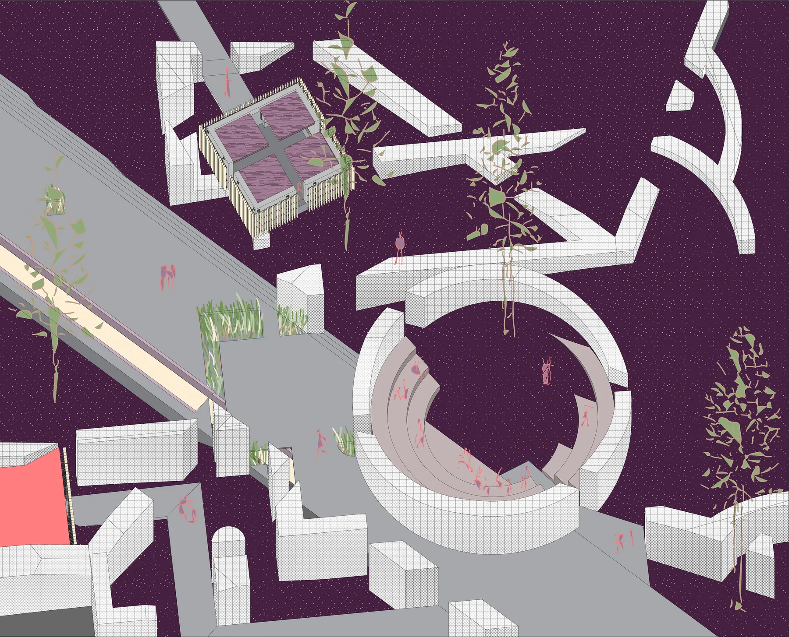

Void and being are opposite but the construction of void, death, only contributes to the definition of being. The moment void is quantified and given name (being dead), a shape, or identity (the Reaper), we are not only contradicting void, but paradoxically constructing being. The further we attempt to define void, the further we ultimately define being. It is the space between awareness and the constructed understanding of void that this funerary landscape seeks to engage. The construction of void influences choice and action by positing death as the punctuating consequence to being. The punctuation is generally manifest through funeral or burial ritual that is prescriptive. This field of remembrance, memorial, and burial attempts to exercise the state of being through choice, multiplicity, and ambiguity, hopefully resulting in the discovery of solace in everything that void is not.

