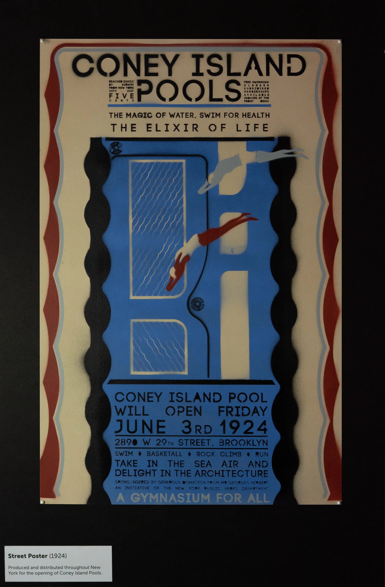
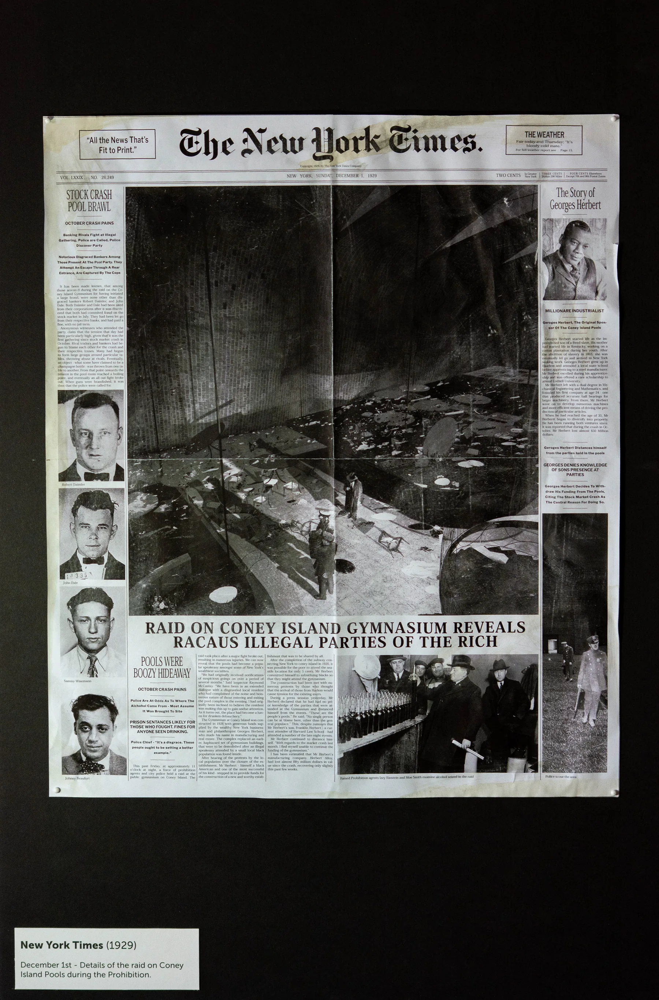
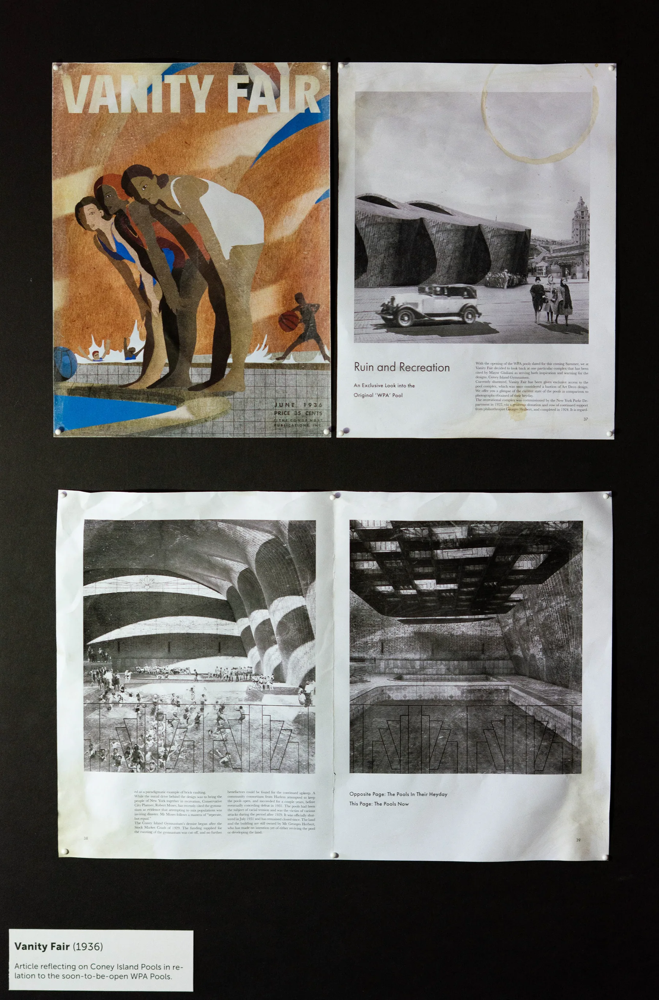
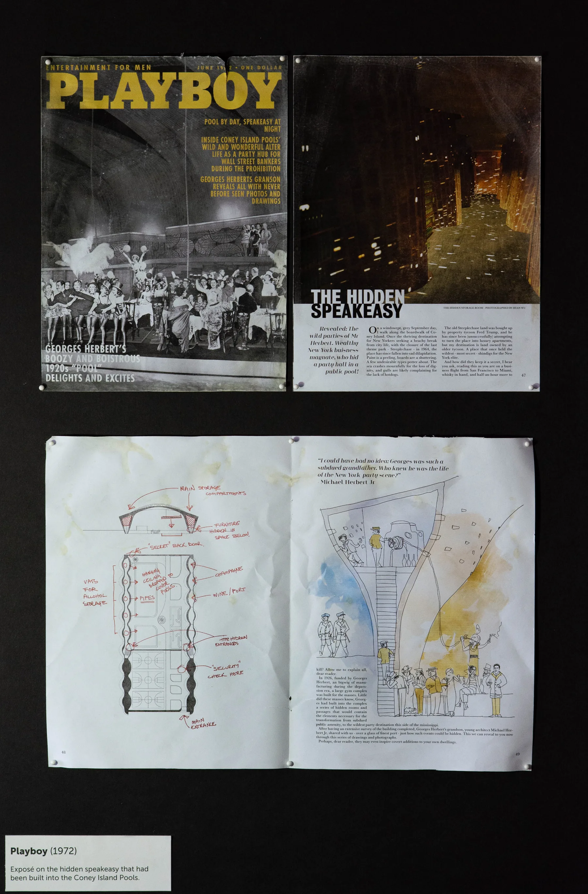
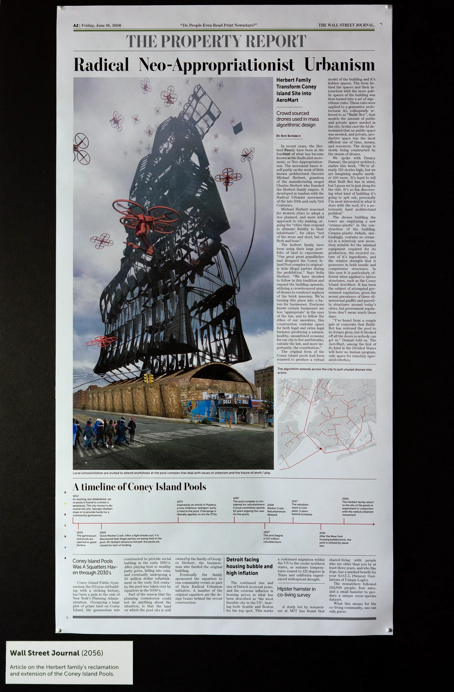

An alternative history of the WPA pools, told through Coney Island Pools, a public pool and gymnasium on Coney Island, and the printed matter it left behind: the street poster for its opening in 1924, a New York Times report of a raid on the parties held there during Prohibition in 1929, a Vanity Fair article on the shuttered pools in 1936, a Playboy exposé of the speakeasy hidden inside them in 1972, and a Wall Street Journal article on their reclamation and extension in 2056.

