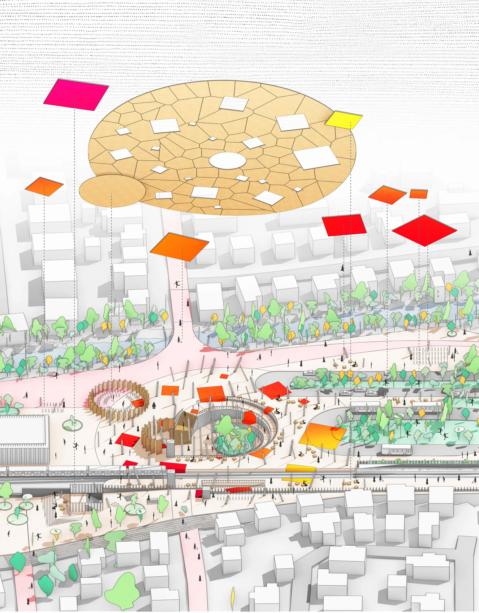
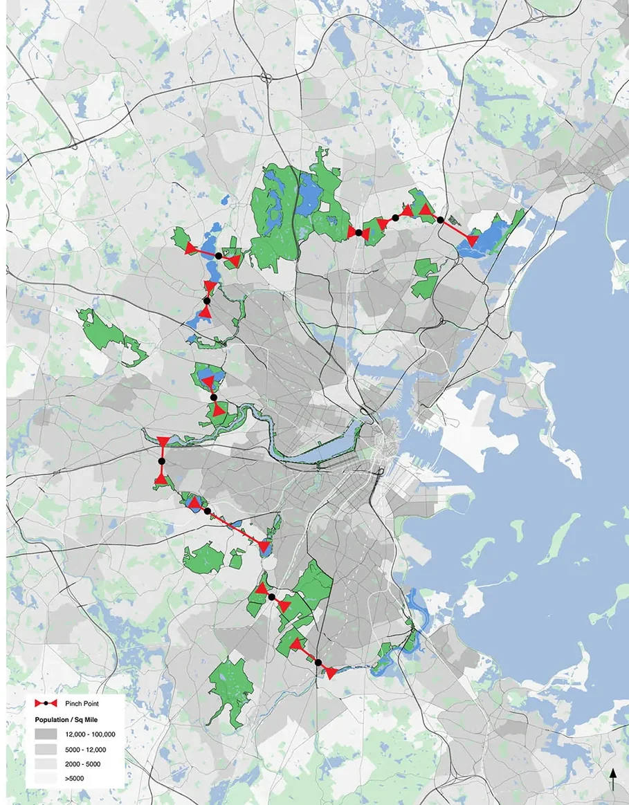
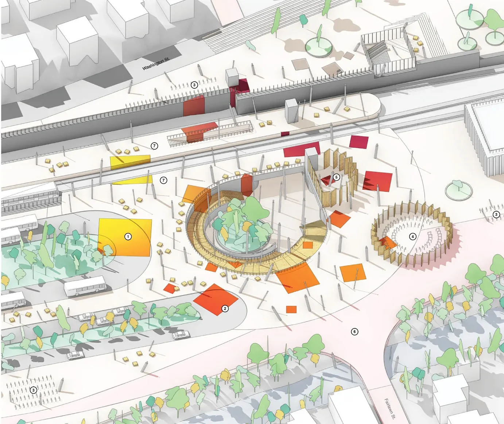
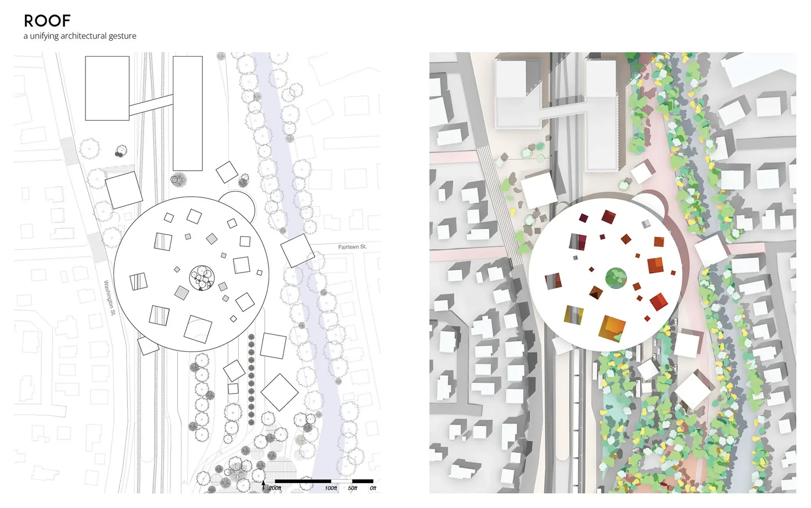
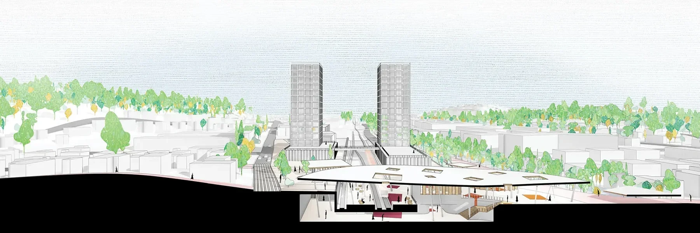
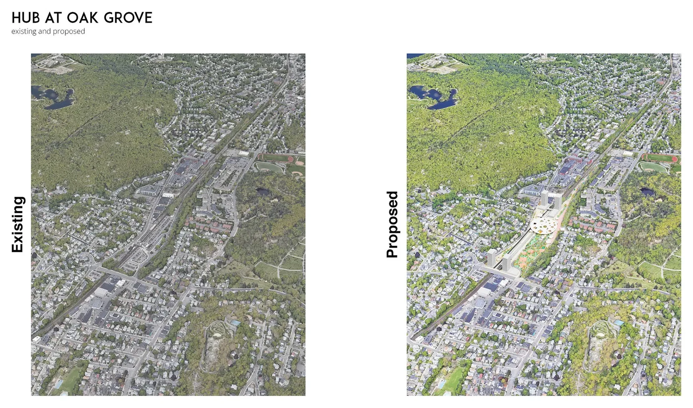
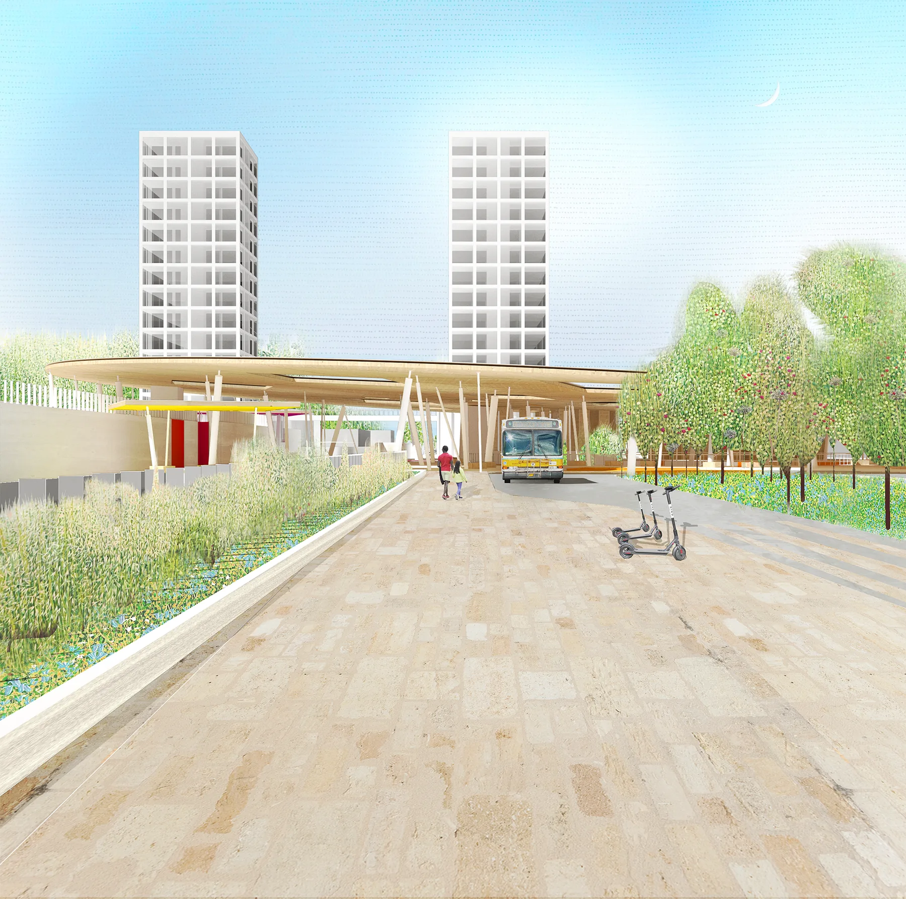

Pinch Point builds on a hypothesis that a series of large nature reserves and parks act as a geologic boundary to Boston’s metro density. Powerful flows of rail and car infrastructure pass through these pinch points creating impassable torrents of movement towards Boston. Conceptualizing the pinch points as a center provides an anchor for hyper-density from which density can radiate in both directions, as well as an opportunity to stitch adjacent green spaces together through carefully articulated transects that bridge across existing boundaries. Rather than serving as a funnel for movement towards Boston and a diffuser towards the suburbs, the pinch point becomes an urban destination that provides access to urban parks and open space. The primary architecture that facilitates these opposing pinch point flows is the multi-modal transit hub and associated transit-oriented development.

