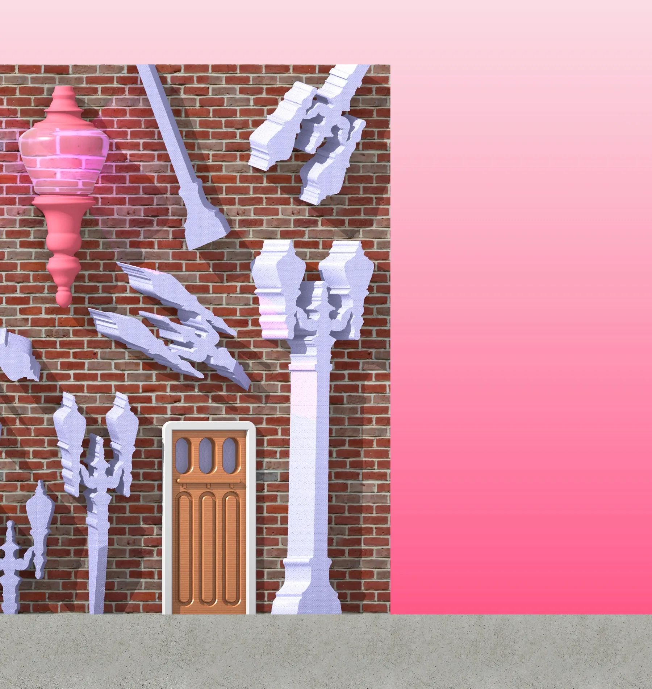

This wall is part of a series of “Portland Walls” in a collaborative project with Office Andorus, exhibited in the Portland State faculty show *Extracurricular PSU*. Using the “wall” as an architectural canvas, the wall should manifest Portland through objects both referential and reflective. Here, the strange, obliquely extruded profiles of historic cast-iron street lamps protrude from the wall, dematerialized and scaled. They sit adjacent to a caricatured, plastic craftsman door, of the kind commonly seen in turn-of-the-century Portland bungalows. This wall is a comment on Portland’s relationship with old and new.
