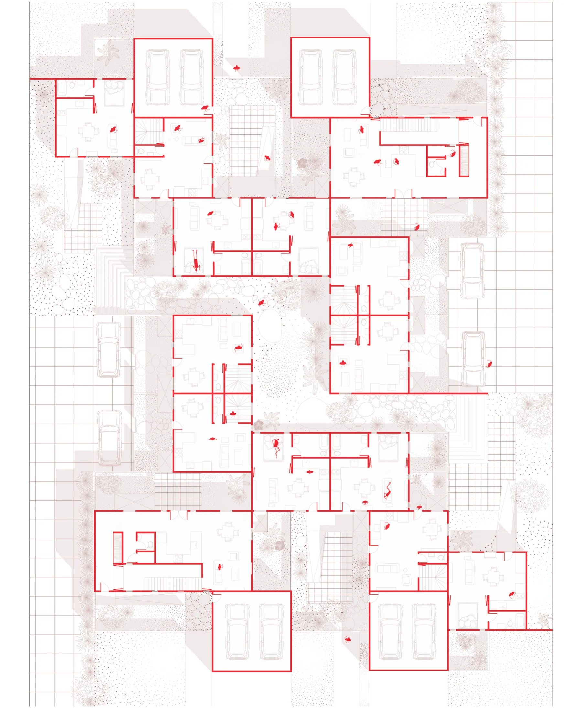
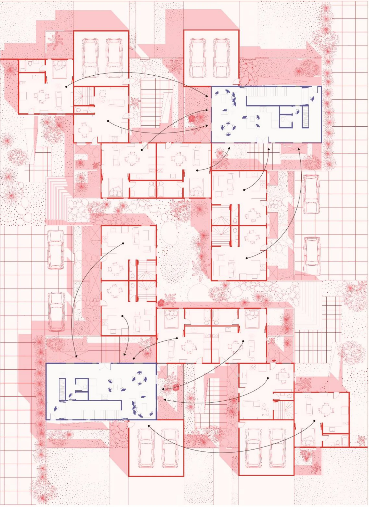

Heat waves are getting hotter, longer and more frequent. When everyone turns on the air conditioning at once the grid strains, and sometimes it fails, leaving people in houses that were never meant to work without power. Most new American homes are single-family houses, low and spread out, built to the minimum energy code.

This thesis asks what it would take for those houses to hold up in a heat wave, with the power on and with it off. The first half is a simulation study, and the second turns what it found into buildings. The drawings are painted in thermochromic paint, which fades as it warms, so with heat applied they show the heat wave. Hover over a painting, or tap it, to apply the heat.

## One hot week in four cities

A single-family house was modelled in Phoenix, Austin, Miami and Washington DC, once to the local energy code (IECC) and once to the Passive House standard, the gold standard for efficiency. Each was run through the hottest week of the year, in historic weather and in the weather projected for 2020, 2050 and 2080 under a high-emissions scenario. With the power on, the measure is the energy it takes to keep the house cool. With the power cut on the second afternoon, it is the number of hours the inside passes a heat index of 32 °C, where heat exhaustion becomes possible.

- The peak hour of cooling, the load that strains the grid, grows by 20% at most by 2080. The cooling over the whole week grows by about 40%, mostly at night, when the house no longer cools down. The grid can manage that; a family already stretched by its bills may not.
- Passive House cut the peak by 30% and the week's cooling by 33%, on average across the cities and climates.
- Without power, almost every house passed 32 °C for most of the week. Passive House helped only where its slab sat directly on the ground. In DC, where the slab is insulated as the standard asks, it did worse than the code house: the insulation keeps out the cool of the earth along with its heat.

## The ground under the model

Phoenix comes through the four-city study remarkably well: neither house passes 32 °C until 2080. Later in the thesis a code house built the same way, in the same hot week of 2050 weather, passes it for 122 of the 128 hours without power. The biggest change between the two is the model of the ground under it.

EnergyPlus works out heat moving through a wall in one dimension, from one temperature to another. The ground is three-dimensional and slow, taking months to warm and cool, so every way of modelling it simplifies somewhere. Most give the ground a fixed temperature for each month: the EnergyPlus default of 18 °C, a rule of thumb of 2 °C under the thermostat, or monthly values from EnergyPlus's slab and basement preprocessors, which is what the four-city study used. Ground Domain and Kiva instead work out the soil itself, in two dimensions, hour by hour.

For a house on an uninsulated slab, which the energy code allows in hot climates, the choice changes the answer by nearly four times. With insulation under the slab, the methods roughly agree.

The power cut shows it more starkly. Here the same house loses power on the second afternoon, and the ground is modelled three of those ways.

It is easy to miss. Every method runs without complaint, and in a large building the ground is a small part of the whole. In a small house on a slab it is a large part, and in a power cut it is the one cool thing the house still touches. The thesis compares the methods, proposes a simple one for basements that agrees with the detailed ones, and releases [Jerboa](https://www.food4rhino.com/en/app/jerboa), a toolset that brings them into Grasshopper. The design work that follows uses Ground Domain.

## Three moves

The design work is set in Phoenix, in 2050 weather, and keeps code-minimum walls and windows throughout, to see how close building form alone can come to Passive House. Each move is tested on its own and then drawn as a house on a 65 by 100 foot lot.

**Ground.** Bedrooms go into a basement, lit by light wells, clerestories or skylights. In a power cut the lower floor stays far cooler, and in four of the six basement layouts tested it never passed 32 °C. In a heat wave the family can live downstairs: cooling only the basement and letting the upper floor run free with its windows open cuts cooling per person by 63%.

**Party walls.** Houses that share a wall or a floor have less of themselves in the sun and more people to share the cooling. Two houses side by side save 5% per person; an apartment under a house saves 19%. The shared wall also brings neighbours close, which counts in a disaster, and lets one plot hold more than one kind of home.

**Nests.** A cool room is set inside the house, wrapped by the others as a buffer. Cooling only the nest, for the whole family, cuts cooling per person by a third to a half, though cooling one ordinary corner room does about as well. The nest earns its place in a power cut, when the larger ones stay cooler than the rooms around them for longer, even if they still pass 32 °C.

**Huddle House.** The three moves together, as three homes in one building.

In a power cut, the ground does the most. Each house is set here against the IECC house through the same hot week, and the power goes out on the second afternoon.

## A heat resilient hamlet

The hamlet brings the moves to four suburban plots in Phoenix, between two streets. From the street it looks like its neighbours, with low houses, private entrances and gardens, but it houses about thirty people, roughly twice as many as before. The three-bedroom houses have bedrooms in the ground, and the one and two bedroom homes and the studios sit a little below grade, reached by driveways at either side.

Built to the code, the hamlet uses only 6% less cooling per person than a code house on a plot of its own. The savings come from how it is used in a heat wave: cooling only the rooms below ground takes that to 41%, and to 53% with Passive House construction. If the power fails, those rooms pass 32 °C for half the hours a code house would, or, in the one and two bedroom homes, for almost none.

The last scenario is the most hopeful. On the hottest evening the neighbours gather in the one or two houses with the biggest air conditioners and turn the rest off. The hamlet then uses 45% less cooling per person than a code house: a heat wave party.

---

The full thesis is at [DSpace@MIT](https://dspace.mit.edu/handle/1721.1/144536). Related work, with David Birge, Zhujing Zhang and Leslie K. Norford, appeared as [Design of heat-resilient housing in hot-arid regions](https://www.sciencedirect.com/science/article/pii/S0378778824011198) in *Energy and Buildings* in 2025.
