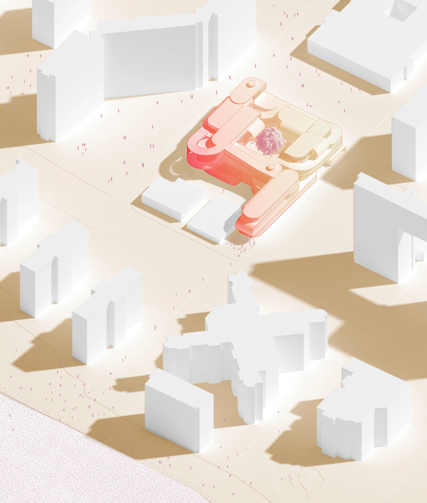

The YMCA facility has a set of complicated and difficult challenges. The context of the Y demands security and safety while the ethos of the Y asks the architecture to imbue publicness and community. The building, from the state of the art pool filtration system to classrooms and community spaces is a manifestation and representation of the Y as an indispensable community resource. Central to the mission of the Y is the notion of movement as Samuel Moore enthusiastically conveyed as he toured us around the cardio studio at the Coney Island Y. “We’re all about getting people moving no matter how old you are or what you look like!” This proposal for the Y of Coney Island leverages the formal device of the continuous surface and applies it as datum upon/within which movement is axiomatic, commonality and democracy are inherent, and programmatic/organizational concerns are sensitively addressed.

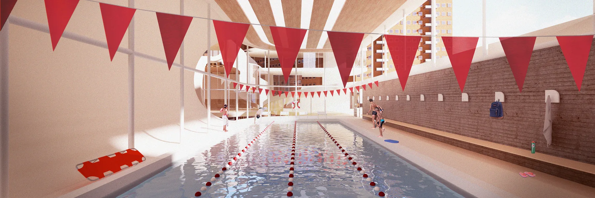

From the found object of a circuit board, I became interested in the board itself both as a datum of organization and a medium for the movement of energy through space. A basswood replica of the board (top right) isolates the formal qualities from graphic qualities of the circuit board. Two models (second row) entertain possibilities of the datum, introducing hierarchy, apertures, punctures, and volumes. The bottom four models explore the surface as dynamic, introducing a language of folding and ramping while reincorporating graphic elements found in the original found object of the circuit board.

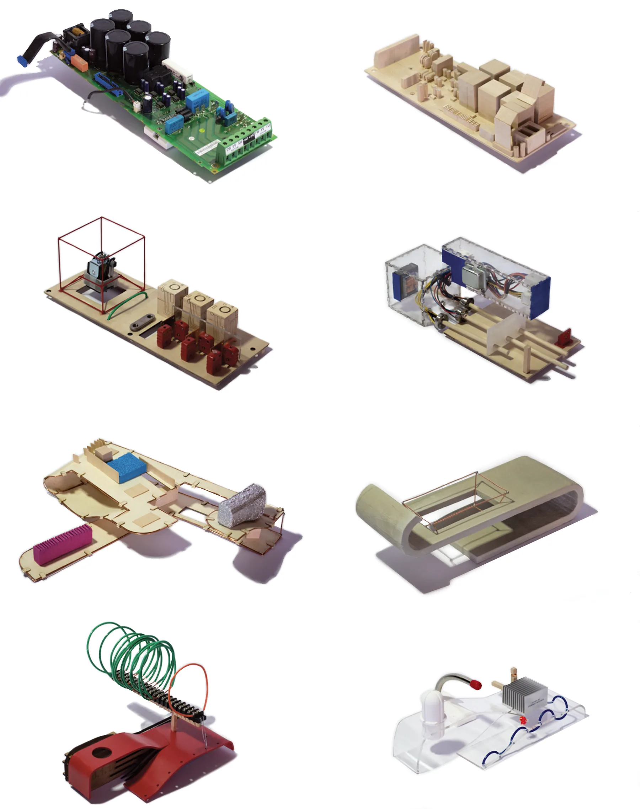

An extremely formative realization was that while the Y’s programs are ostensibly public, privacy is paramount, especially in pools, daycare spaces, and exercise spaces. This concept significantly influenced the Y’s program being conceptualized as a diagram of discrete nodes with major and minor paths that connect them. With concerns of privacy and regulation, some programs, like the kids pool, were considered dead end programs, where others, like locker rooms or the gym, were considered as nodes with multiple directions of circulation flow and thus were connected to multiple other programs. This diagram and the importance of privacy guided the assembly of the surface from the formal index. In plan, an example of this logic is expressed in the placement of the childcare center (top right) at the end of a single narrowed path, which requires a departure from the main building to access.

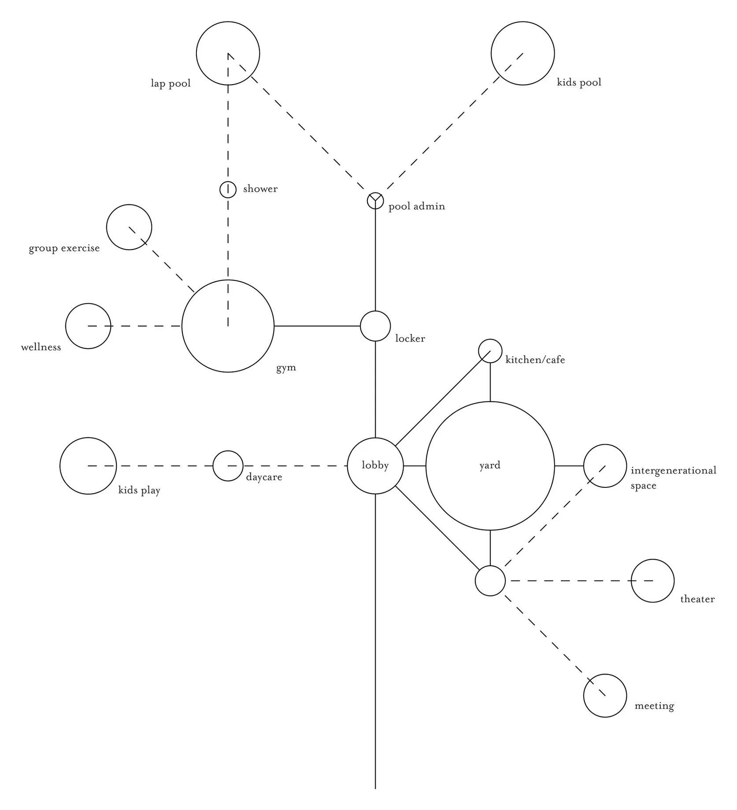

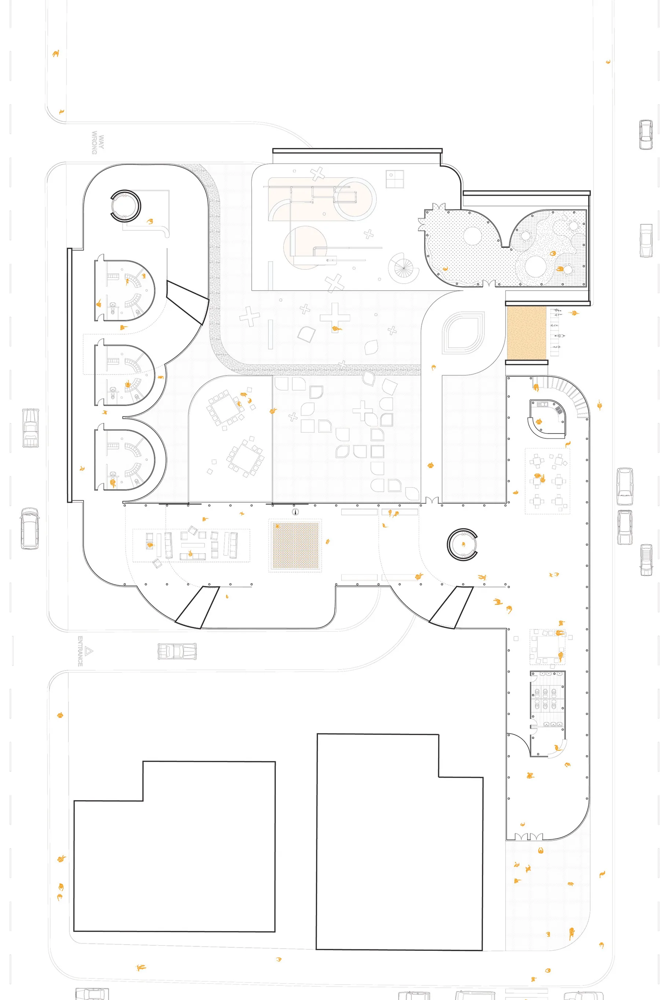

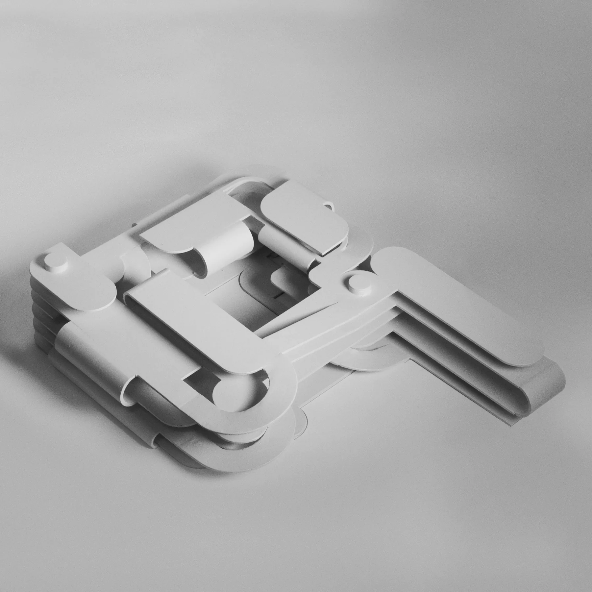

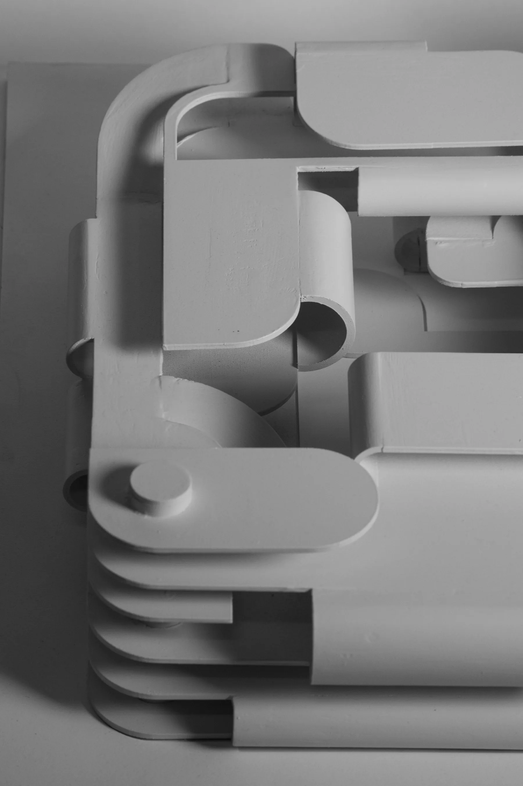

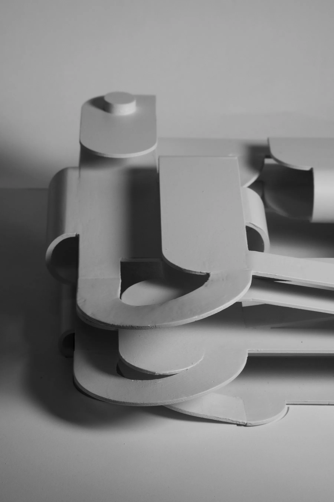

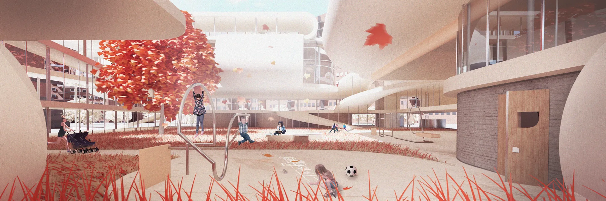

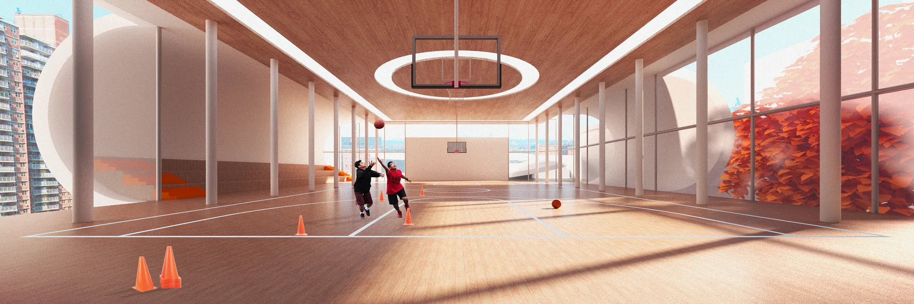

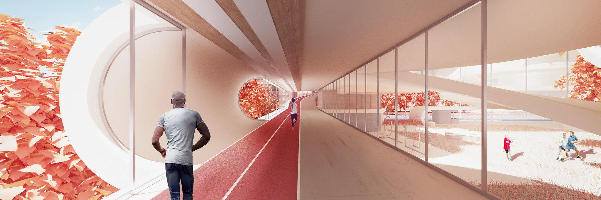
