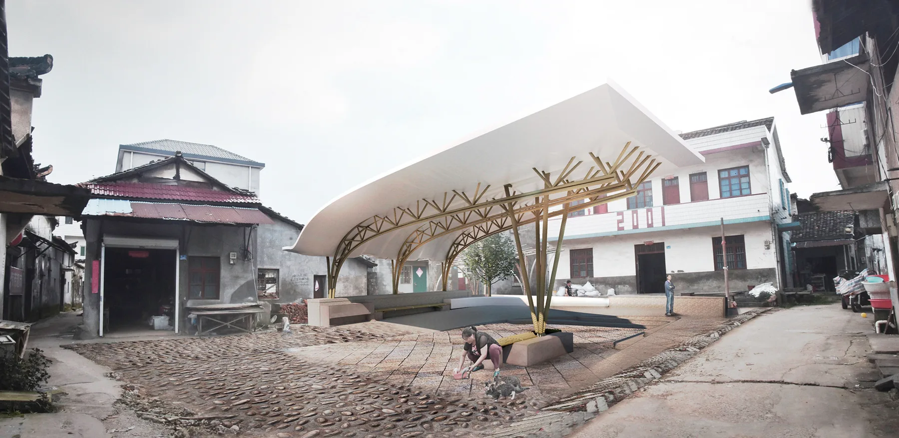
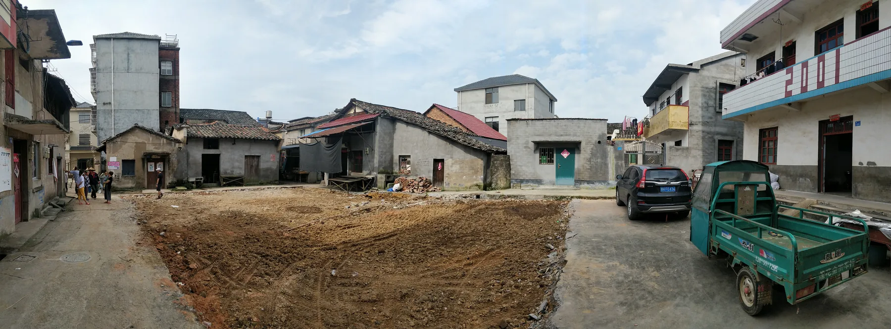
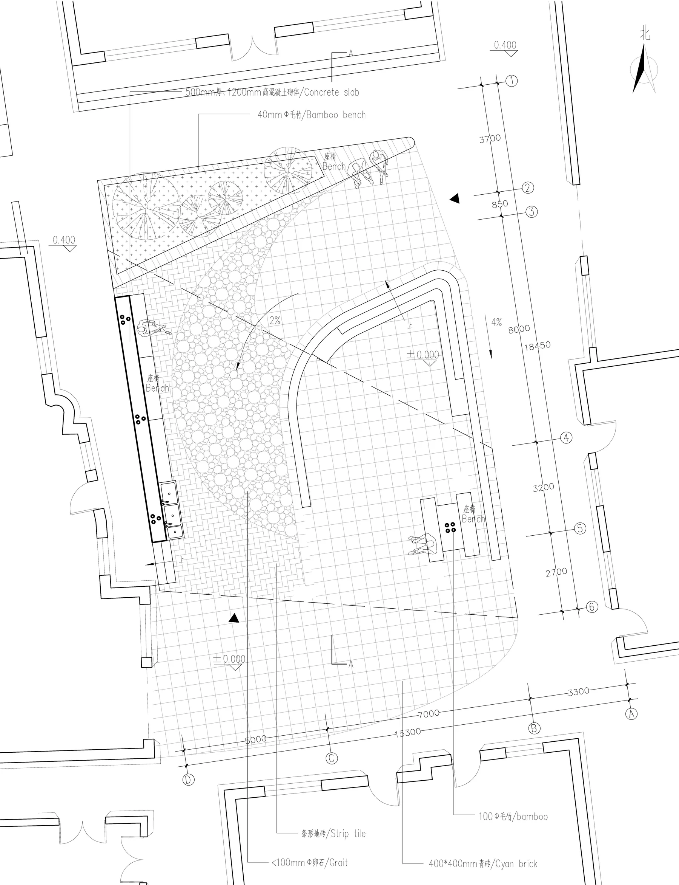
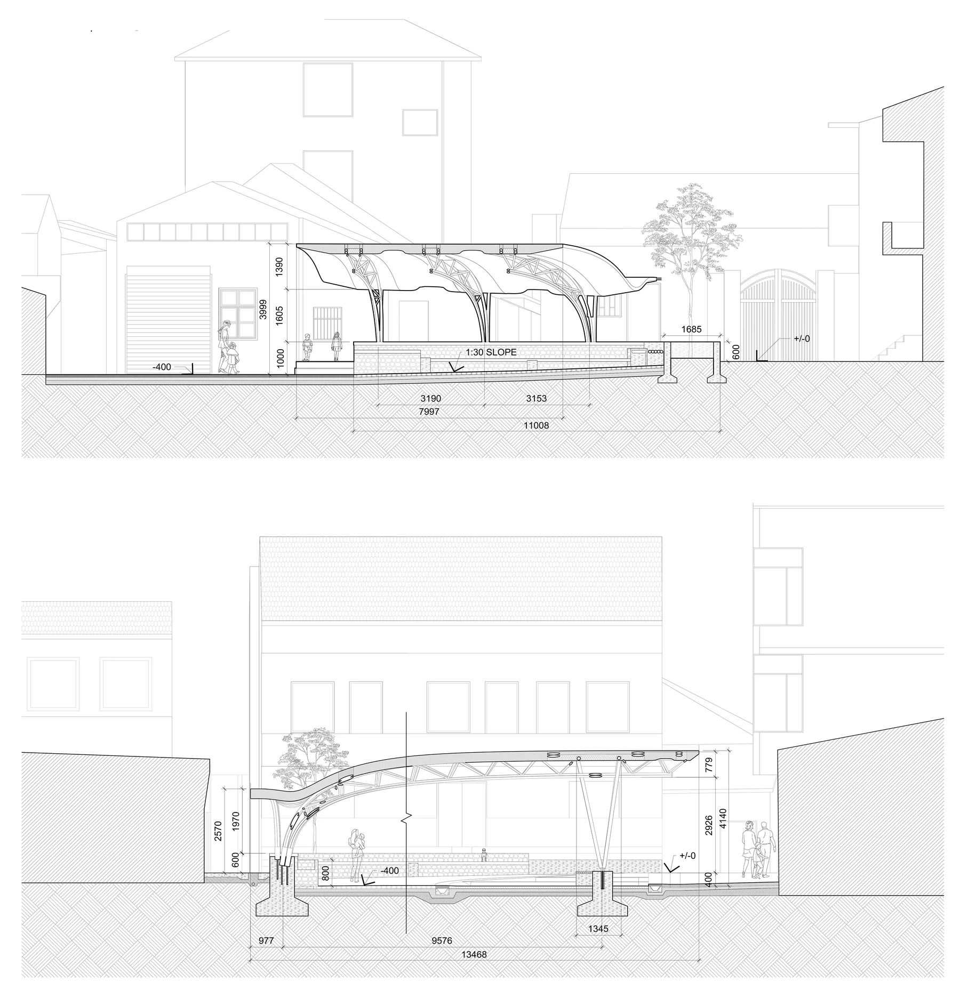
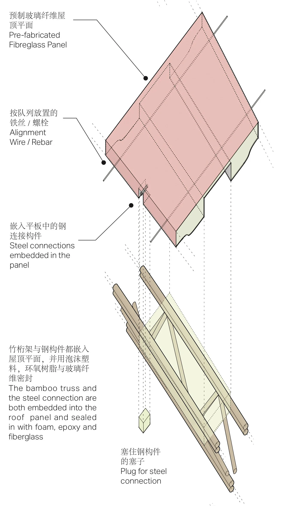
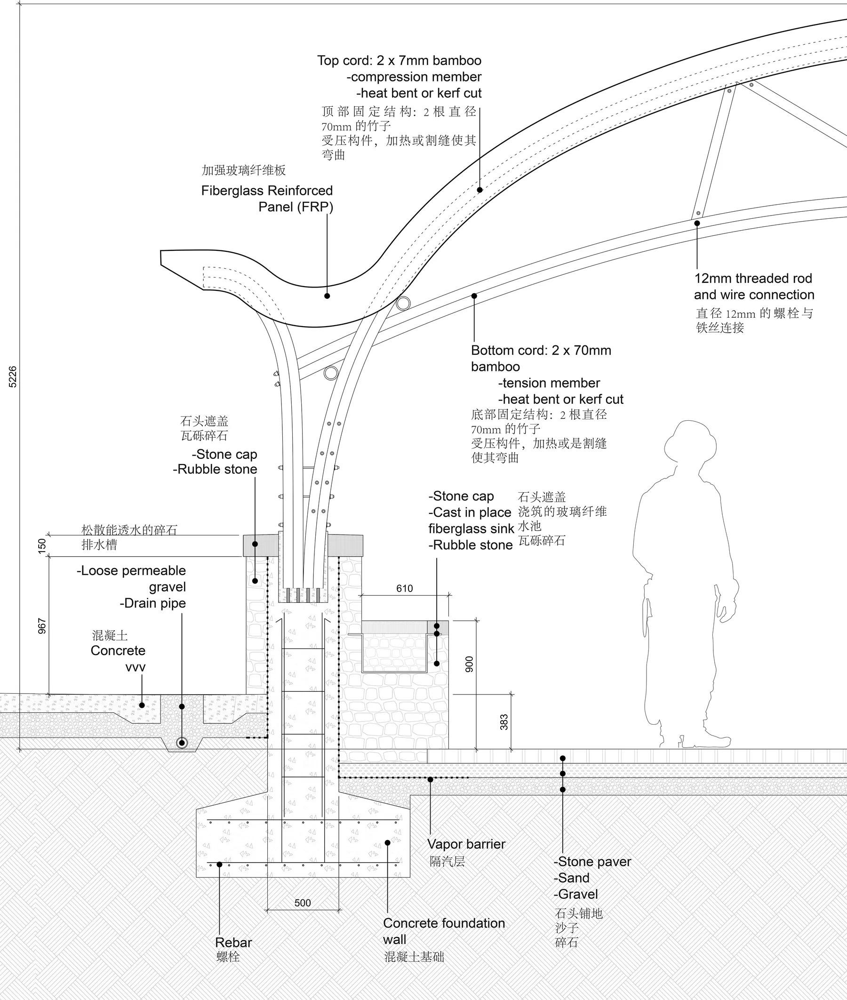
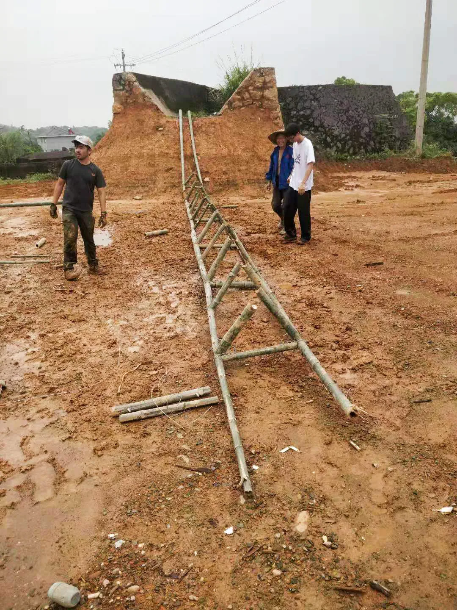
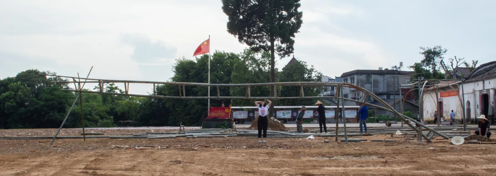
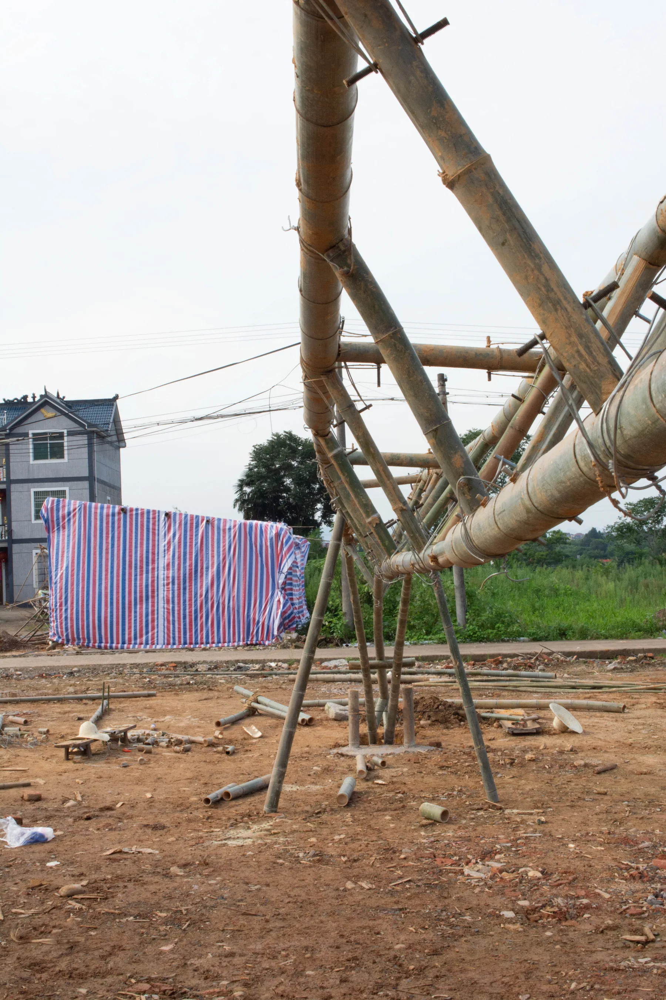

## Site

## Roof Assembly

The roof is made of prefabricated fiberglass panels, lined up on alignment wire or rebar. Each carries a bamboo truss: a top chord of two 70 mm bamboo poles in compression and a bottom chord of two in tension, each heat bent or kerf cut to the curve. The truss and its steel connections are embedded in the panel and sealed in with foam, epoxy and fiberglass.

## 1:1 Mock-up

