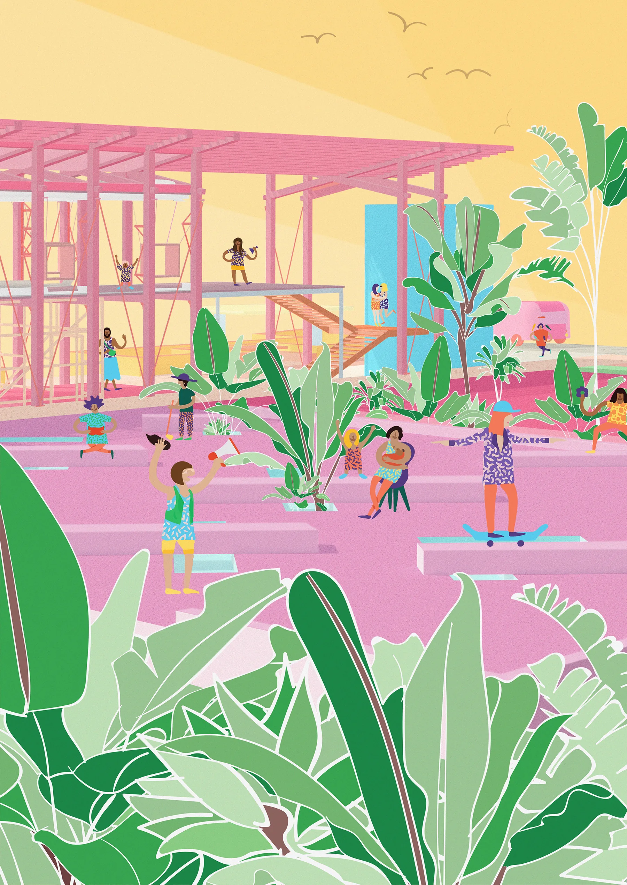
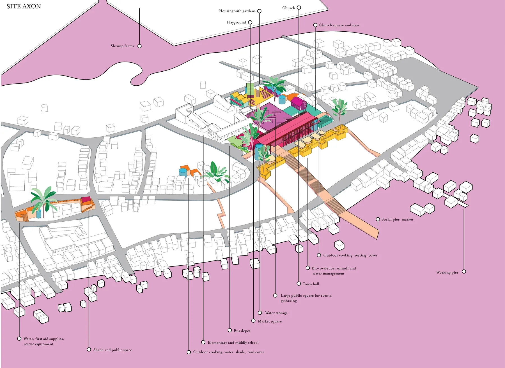
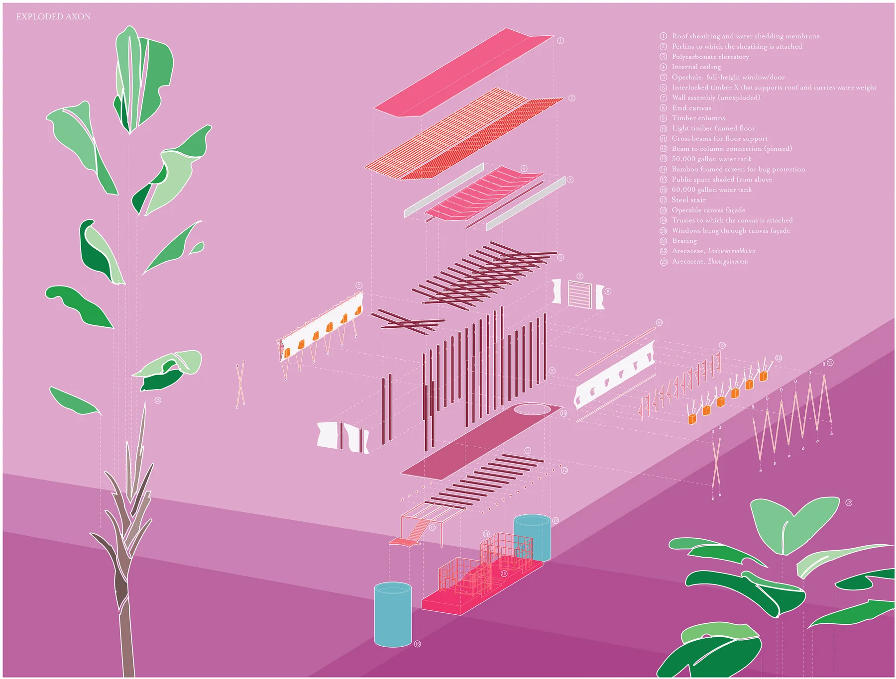
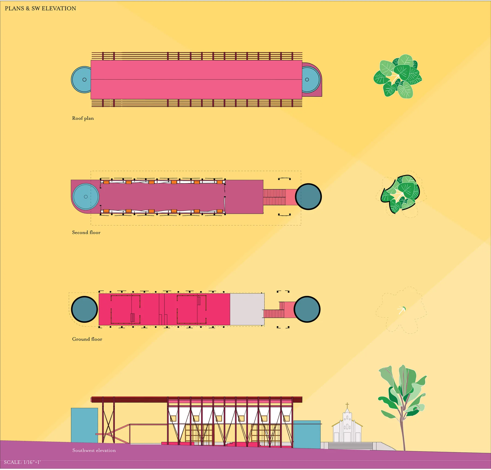
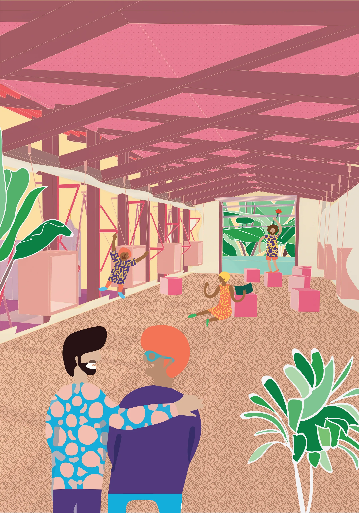
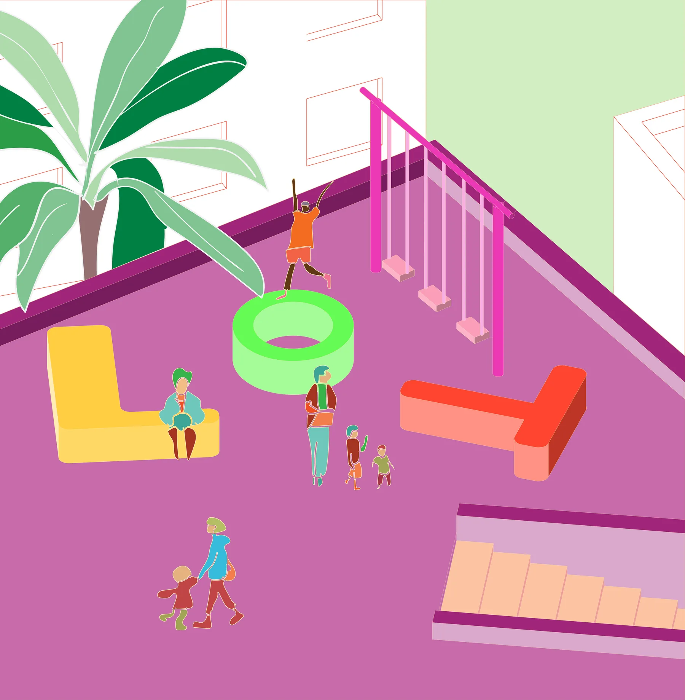
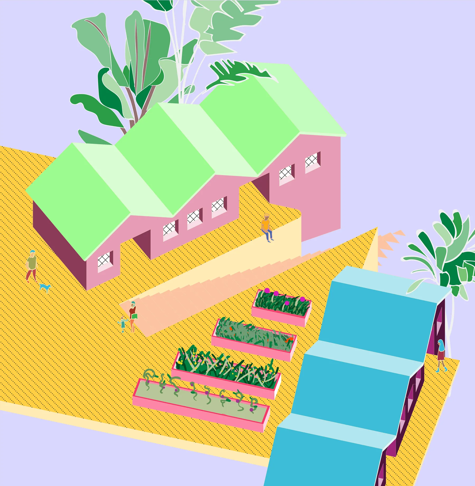

Informal networks and common knowledge are much more effective in preventing loss of life in the event of a disaster rather than scientific, man made systems. This multi-phase proposal seeks to shift the density of Chamanga, Ecuador to higher ground which is less susceptible to flooding, landslides, and liquid soil conditions in the event of an earthquake like the one that occurred in 2016. To do this, the proposal emphasizes the importance of social capital’s role in disaster safety and preparedness. This proposal seeks to install a resilient core that creates a common sense, intuitive understanding of safety zones by establishing areas of high social capital and by constructing new routes of access both within the town and from town to water. The final phase of the project is a town hall that provides space for meeting and gathering as well as water collection and storage.

A **strong entry** corridor with tributary access to the water and town becomes a central **evacuation** route in the case of emergency. An earthquake **resistant core** defined in the community as an area of high social capital and community assets. This core, while mentally and socially defined, is **soft edged** and **blended** with the current village fabric. This core’s intention is not to be a utilitarian, unifunctional object inserted into Chamanga; rather it is intended to create space that enhances and promotes the creation of social capital on higher ground.

The core is built in six phases:

1. Small cores placed at high elevations, with direct paths to and from the waterfront, provide water, shade, outdoor cooking, social space, and emergency medical supplies.
2. The central core begins with a pedestrian walkway, separated from the road, and a public square near the school and church.
3. A bus station reinforces the main core as the center of arrival and departure, joined by two church squares and water storage.
4. A large stair and pier connect the water to the central core, providing social space, working space, and access.
5. Bioswales treat runoff from the social squares and carry excess water to storage tanks, and prevent erosion. A large main square is added.
6. Housing is connected to the main square, with resilient gardens and food-producing infrastructure.

The Town Hall is a primarily open structure, designed to resist earthquakes and tremors. Two large water tanks flank and anchor the structure, both filled by the inverted roof. This provides water to Chamanga where clean water is scarce. Canvas walled, the upper floor is flexible. On summer evenings, the walls may be opened to reveal views of the estuary to the west and of the town squares to the east, but on hot summer days, the breathable canvas provides shade and protection from bugs.

